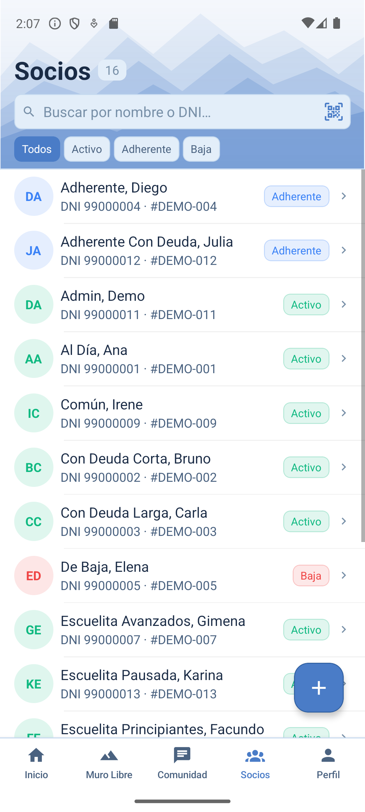
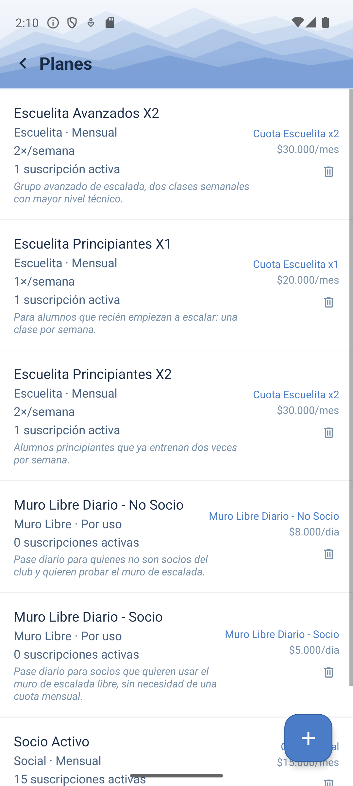
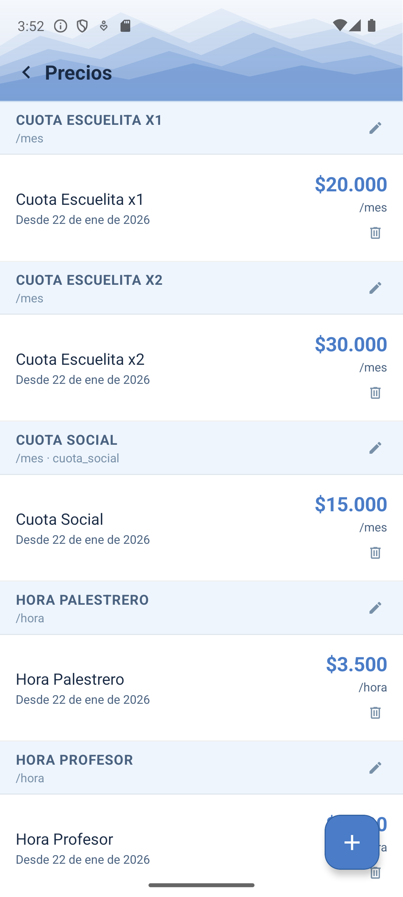
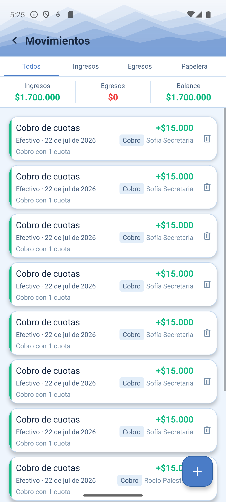
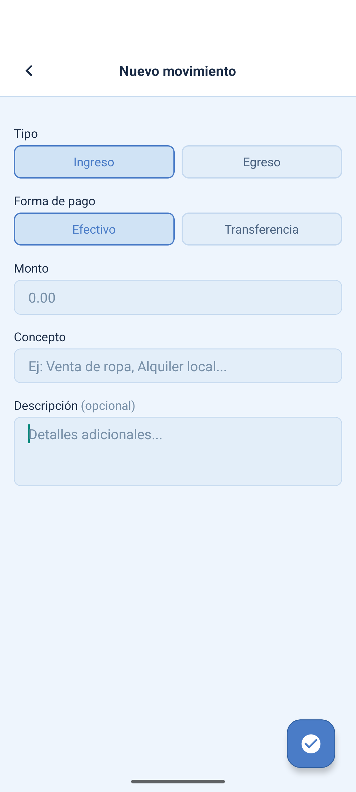
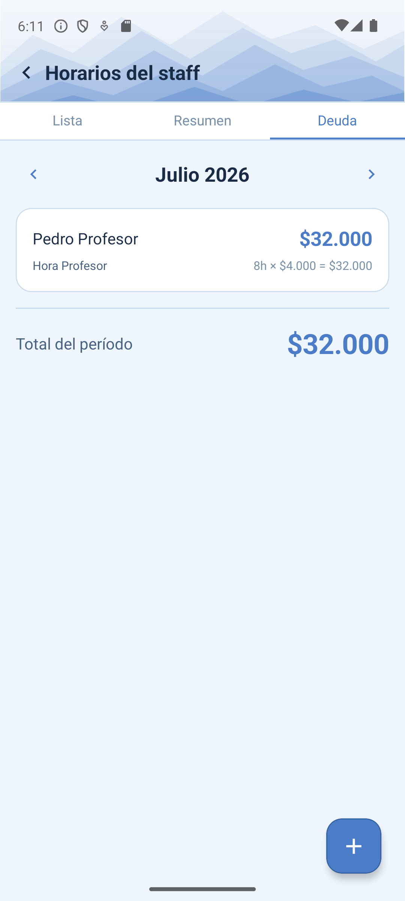

# Manual de Admin / Autoridad

El rol **Admin** tiene acceso total: es el que configura el club (planes, precios, roles), da de alta y de baja socios, y puede revisar y revertir cualquier cambio hecho por el resto del equipo. En el CARC lo usan la comisión directiva y quien administra el sistema.

```text title="Login de prueba"
admin@demo.appclub.ar / DemoAdmin2026!
```

!!! tip "¿Sos autoridad del CARC?"
    Entrá con tu usuario real desde [/app/login](https://raspberrypi.tail703951.ts.net/app/login) y vas a ver exactamente estas mismas pantallas, con los datos reales del club.

## 1. Socios — alta, baja y ficha

La ficha de cada persona del club: datos personales, estado (Activo / Adherente / Baja), deuda de cuota social, y accesos directos a registrar un cobro o ver su historial de escuelita / muro libre.

<figure markdown>
  { width="260" }
  <figcaption>Lista de socios</figcaption>
</figure>

**Dar de alta un socio nuevo**

1. Andá a `Socios` y tocá el botón de agregar (+).
2. Completá nombre, apellido, DNI y los datos de contacto que tengas.
3. Guardá — el socio queda creado, pero sin ninguna cuota asociada todavía (ver [Suscribir un socio a un plan](#4-suscribir-un-socio-a-un-plan)).

**Dar de baja / reactivar**

1. Abrí la ficha del socio.
2. Cambiá el estado a `Baja` (o de nuevo a `Activo` si vuelve).
3. Un socio de baja deja de generar deuda nueva, pero conserva su historial.

## 2. Planes — crear planes nuevos

Un **Plan** es lo que se le ofrece a un socio: "Cuota Social", "Escuelita Principiantes X2", "Muro Libre Diario", etc. Cada plan tiene un tipo (social / escuelita / muro_libre), una etiqueta de cobro asociada, y una descripción que sirve para que todo el equipo entienda para qué es.

<figure markdown>
  { width="260" }
  <figcaption>Lista de planes</figcaption>
</figure>

**Crear un plan nuevo**

1. Andá a `Planes` y tocá el botón de agregar (+).
2. Elegí el tipo de plan (social, escuelita o muro libre).
3. Ponele un nombre claro y una descripción — se usa en toda la app para que el resto del equipo sepa qué incluye.
4. Asociale la etiqueta de cobro correspondiente (ver [Precios y etiquetas](#3-precios-y-etiquetas)) — de ahí sale el precio.
5. Si es de escuelita, definí cuántas clases por semana incluye — eso es lo que controla el límite al tomar asistencia.
6. Guardá. El plan ya queda disponible para inscribir socios (escuelita) o para referenciar en un cobro.

## 3. Precios y etiquetas

Una **Etiqueta** es un concepto de cobro (ej. "Cuota Escuelita X2", "Hora Profesor") con una unidad (mes, día, hora). El **Precio** vigente de esa etiqueta es lo que se usa como monto sugerido al registrar un cobro. Separar etiqueta de precio permite ir actualizando montos (por ejemplo, por inflación) sin perder el histórico de qué se cobró en cada mes.

<figure markdown>
  { width="260" }
  <figcaption>Precios por etiqueta</figcaption>
</figure>

**Actualizar un precio**

1. Andá a `Precios`, buscá la etiqueta que querés actualizar.
2. Cargá el nuevo monto — queda vigente desde ese momento, sin pisar los cobros ya registrados con el precio anterior.

## 4. Suscribir un socio a un plan

Una **Suscripción** es el vínculo entre un socio y un plan — es lo que determina qué le corresponde pagar cada mes.

!!! warning "Limitación conocida"
    Para **escuelita**, la suscripción se crea sola al inscribir al alumno (ver el manual de [Secretaría](secretaria.md)/[Profesor](profesor.md)). Pero para planes que **no** son de escuelita (por ejemplo pasar a un socio a "Cuota Social" o activarle un "Muro Libre mensual"), todavía no hay una pantalla en la app para hacerlo — se resuelve manualmente por fuera de la app. Ya está anotado como pendiente ([issue #8](https://github.com/NicoPelos/appCARC-mobile/issues/8)).

## 5. Movimientos — caja del club

Es el registro de caja del club: ingresos y egresos que **no** vienen de un cobro de cuota (por ejemplo, una compra de materiales, un gasto de mantenimiento, una donación). Los cobros de cuota generan su propio movimiento automáticamente — acá se cargan los manuales.

<figure markdown>
  { width="260" }
  <figcaption>Lista de movimientos</figcaption>
</figure>

<figure markdown>
  { width="260" }
  <figcaption>Registrar un movimiento</figcaption>
</figure>

**Registrar un movimiento manual**

1. Andá a `Movimientos` y tocá el botón de agregar (+).
2. Elegí si es `Ingreso` o `Egreso`.
3. Elegí la forma de pago (`Efectivo` o `Transferencia`).
4. Cargá el monto, un concepto corto y, si hace falta, una descripción más larga.
5. Confirmá — queda en la lista, filtrable por tipo con las solapas `Todos / Ingreso / Egreso`.

Un movimiento borrado no se pierde: pasa a la solapa `Papelera`, así siempre queda rastro de qué se eliminó.

## 6. Horas del staff — deuda a pagar

Profesores y palestreros cargan sus propias horas trabajadas (ver sus manuales). Cada hora se paga según una etiqueta ("Hora Profesor", "Hora Palestrero") con un precio propio — esto es, en la práctica, cómo se calcula qué hay que pagarle al staff cada mes.

<figure markdown>
  { width="260" }
  <figcaption>Deuda de staff por período</figcaption>
</figure>

**Ver cuánto se le debe pagar al staff en el mes**

1. Andá a `Horarios` y abrí la solapa `Deuda`.
2. Elegí el período (mes/año).
3. Vas a ver, por cada persona de staff, el total de horas cargadas y el monto que corresponde pagarle (horas × precio de su etiqueta).

## 7. Auditoría — historial revertible

Cada cambio importante (crear, editar o borrar un cobro, movimiento, socio, etc.) queda registrado con quién lo hizo y cuándo. Esto es exclusivo del panel de administración web (superadmin), no de la app del celular.

**Revisar y revertir un cambio**

1. En el panel web, andá a `Auditoría`.
2. Tocá "Ver detalle" en cualquier fila para ver qué cambió, campo por campo (antes / después).
3. Si algo se cargó mal, hay una acción para revertirlo — deshace en cascada lo que corresponda (por ejemplo, revertir un cobro también revierte el movimiento y la cuota que generó).
