# Manual de Admin / Autoridad

El rol **Admin** tiene acceso total: es el que configura el club (planes, precios, roles), da de alta y de baja socios, y puede revisar y revertir cualquier cambio hecho por el resto del equipo. En el CARC lo usan la comisión directiva y quien administra el sistema.

```text title="Login de prueba"
admin@demo.appclub.ar / DemoAdmin2026!
```

!!! tip "¿Sos autoridad del CARC?"
    Entrá con tu usuario real desde [/app/login](https://raspberrypi.tail703951.ts.net/app/login) y vas a ver exactamente estas mismas pantallas, con los datos reales del club.

## 1. Socios — alta, baja y ficha

La ficha de cada persona del club: datos personales, estado (Activo / Adherente / Baja), deuda de cuota social, y accesos directos a registrar un cobro o asignarle un plan.

<figure markdown>
  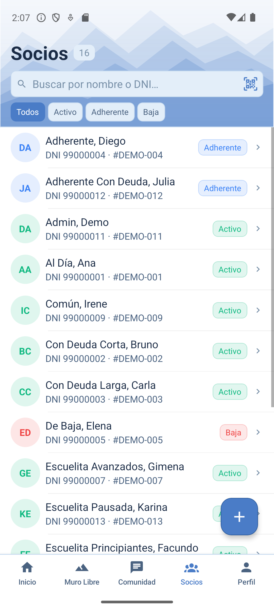{ width="260" }
  <figcaption>Lista de socios</figcaption>
</figure>

Más abajo en la ficha (para roles con permiso — admin y secretaría) hay dos secciones de solo lectura con lo último de esa persona: `Visitas`, con sus últimas 10 asistencias a muro libre y escuelita (tipo, fecha y tipo de pase), y `Pagos`, con sus últimos 10 cobros (fecha, forma de pago y monto).

**Dar de alta un socio nuevo**

1. Andá a `Socios` y tocá el botón de agregar (+).
2. Completá nombre, apellido, DNI y los datos de contacto que tengas.
3. Guardá — el socio queda creado, pero sin ninguna cuota asociada todavía (ver [Suscribir un socio a un plan](#7-suscribir-un-socio-a-un-plan)).

**Dar de baja / reactivar**

1. Abrí la ficha del socio.
2. Cambiá el estado a `Baja` (o de nuevo a `Activo` si vuelve).
3. Un socio de baja deja de generar deuda nueva, pero conserva su historial.

## 2. Vincular a un tutor (padre/madre de un socio)

Un socio (por lo general, menor de edad) puede tener uno o más tutores vinculados — un usuario que, al loguearse, puede elegir entrar "como" ese socio: ver su estado de cuenta, pagar sus cuotas, mostrar su credencial, etc. El tutor no necesita ser socio del club.

<figure markdown>
  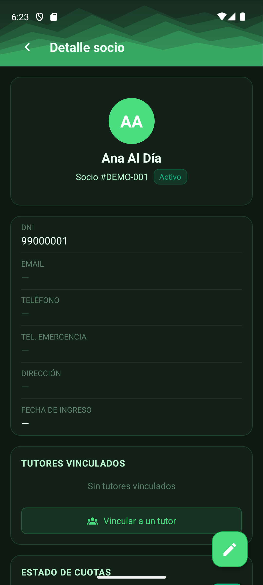{ width="260" }
  <figcaption>Vincular a un tutor desde la ficha del socio</figcaption>
</figure>

**Vincular un tutor**

1. Abrí la ficha del socio (el "hijo") y tocá `Vincular a un tutor`.
2. Elegí el modo, según si el tutor ya es socio del club o no:
    - `Es socio del club` (modo por defecto): tocá `Buscar socio` y elegilo de la lista — queda vinculado al confirmar la búsqueda. Si ese socio todavía no tiene cuenta de login, se le crea una automáticamente (mismo aviso de contraseña temporal que en el modo "No es socio", ver más abajo).
    - `No es socio`: cargá el email del tutor y, si todavía no tiene cuenta en el club, su nombre.

<figure markdown>
  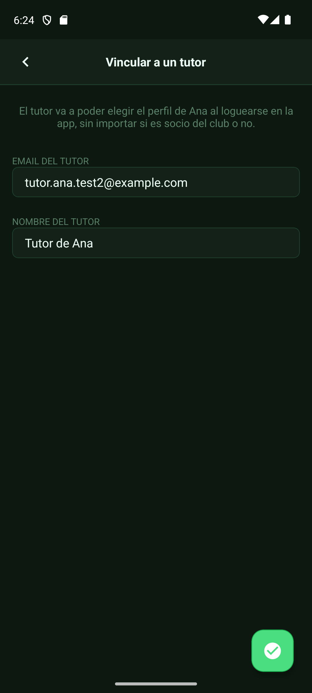{ width="260" }
  <figcaption>Formulario para vincular un tutor</figcaption>
</figure>

3. Si elegiste `No es socio`, guardá.
    - Si el email ya pertenece a una cuenta existente (sea socio o no), se usa esa cuenta.
    - Si es un email nuevo, se crea una cuenta de tutor y la app te muestra una contraseña temporal — comunicásela a mano, es la única vez que se muestra.

<figure markdown>
  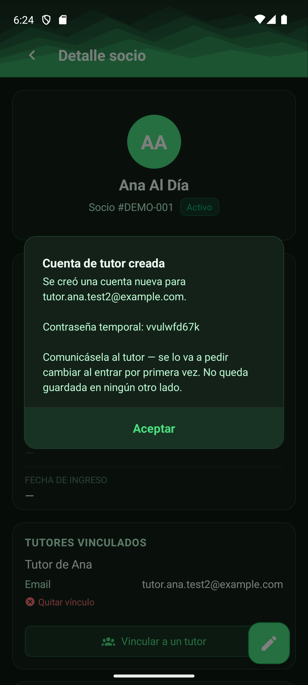{ width="260" }
  <figcaption>Contraseña temporal al crear una cuenta de tutor nueva</figcaption>
</figure>

Los tutores vinculados quedan listados en la ficha del socio, con un botón para quitar el vínculo en cualquier momento.

!!! info "Qué puede hacer un tutor al entrar como el hijo"
    Siempre entra con permisos de socio nomás, sin importar qué rol tenga esa persona en su propia cuenta (por ejemplo, si el hijo es a la vez profesor/a o staff). El vínculo familiar es para gestionar la cuenta de un socio, no para heredar permisos de otra cuenta.

## 3. Planes — crear planes nuevos

Un **Plan** es lo que se le ofrece a un socio: "Cuota Social", "Escuelita Principiantes X2", "Muro Libre Diario", etc. Cada plan tiene un tipo (social / escuelita / muro libre / plan de deuda), una etiqueta de cobro asociada, y una descripción que sirve para que todo el equipo entienda para qué es.

El tipo `Plan de deuda` es distinto de los otros tres: sirve para armarle a un socio puntual un plan de pago en cuotas (por ejemplo, ponerse al día con meses atrasados) sin que eso le cierre automáticamente su Cuota Social real — los demás tipos sí se cierran solos entre sí al asignar uno nuevo del mismo tipo, este no.

<figure markdown>
  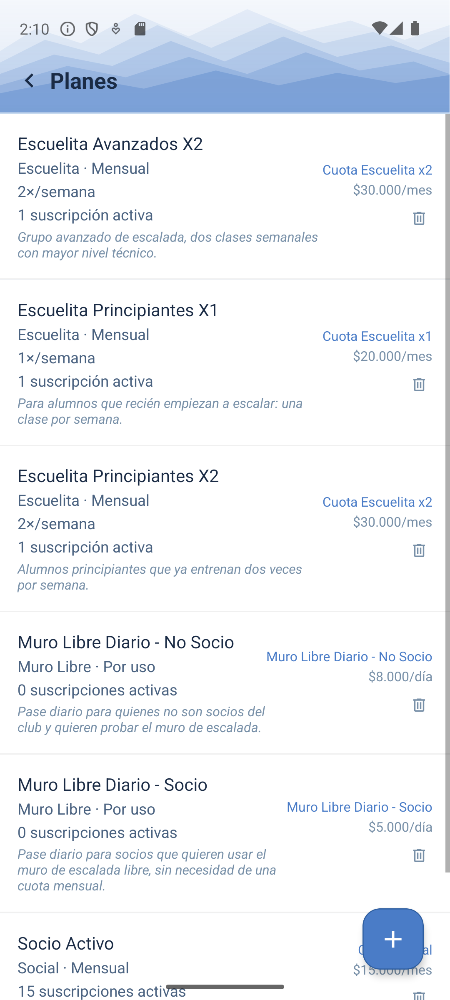{ width="260" }
  <figcaption>Lista de planes</figcaption>
</figure>

**Crear un plan nuevo**

1. Andá a `Planes` y tocá el botón de agregar (+).
2. Ponele un nombre claro — se usa en toda la app para que el resto del equipo sepa qué incluye.
3. Elegí el tipo de plan (social, escuelita, muro libre o plan de deuda).
4. Elegí la modalidad: `Mensual` (genera una cuota recurrente todos los meses, como Cuota Social o Escuelita) o `Por uso` (se cobra por uso puntual, como un pase Diario de Muro Libre, sin generar una cuota fija cada mes).
5. Si el plan no debe generar deuda (por ejemplo "Socio Honorario" o un canje), activá `No genera deuda` — cualquier suscripción que se asigne con ese plan queda exenta automáticamente, sin tener que marcarlo caso por caso.
6. Si es de escuelita, definí cuántas clases por semana incluye — eso es lo que controla el límite al tomar asistencia.
7. Sumale una descripción (opcional).
8. Asociale la etiqueta de cobro correspondiente (ver [Precios y etiquetas](#4-precios-y-etiquetas)) — de ahí sale el precio. Si el nombre que elegiste se parece al de otra etiqueta ya creada, la pantalla te avisa ("⚠ Parecida a: ...") para evitar elegir la etiqueta equivocada por error.
9. Guardá. El plan ya queda disponible para inscribir socios (escuelita) o para asignar directamente ([Suscribir un socio a un plan](#7-suscribir-un-socio-a-un-plan)).

**Editar o eliminar un plan.** Tocando un plan de la lista se abre el mismo formulario, ya cargado con sus datos, para editarlo. Cada fila tiene además un ícono de tacho para eliminarlo (pide confirmación antes de borrarlo).

## 4. Precios y etiquetas

Un **Precio** siempre es un concepto de cobro con su monto vigente (ej. "Cuota Escuelita X2 — $30.000/mes", "Hora Profesor — $4.000/hora"). Por dentro son dos cosas — una Etiqueta (el concepto) y sus distintos montos vigentes a lo largo del tiempo — pero en la app se maneja como una sola pantalla: no hace falta pensar en "etiqueta" y "precio" por separado.

<figure markdown>
  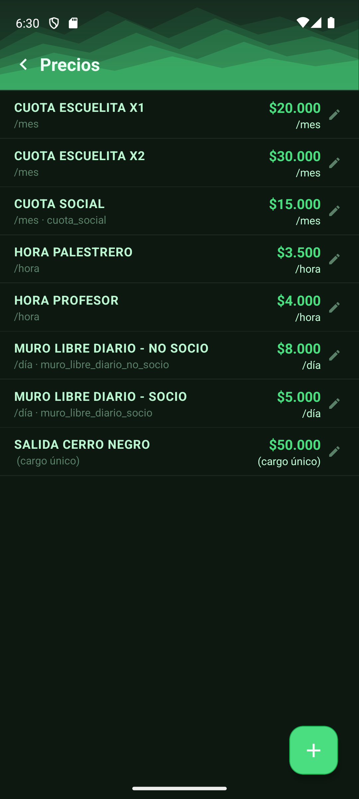{ width="260" }
  <figcaption>Lista de precios — el monto vigente de cada concepto</figcaption>
</figure>

Tocando el nombre de un concepto se despliega su histórico (precios anteriores) o los que ya están cargados a futuro; ahí podés tocar cualquier precio de la lista (el vigente incluido) para editar su monto o vigencia. El lápiz de al lado, en cambio, edita el concepto en sí — nombre y unidad de cobro — no el monto.

**Crear un concepto nuevo (precio nuevo)**

1. Andá a `Precios` y tocá el botón de agregar (+).
2. Elegí `Precio nuevo (concepto nuevo)`.

<figure markdown>
  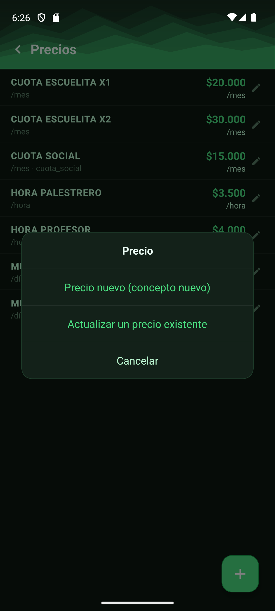{ width="260" }
  <figcaption>Elegir entre precio nuevo o actualizar uno existente</figcaption>
</figure>

3. Ponele un nombre claro (por ejemplo "Salida Cerro Negro") y elegí la unidad de cobro: `Por mes`, `Por hora`, `Por día`, `Por pase` o `Cargo único` — esta última es para cobros puntuales que no se repiten (ver [Atribuir un cargo puntual](#5-atribuir-un-cargo-puntual)).

<figure markdown>
  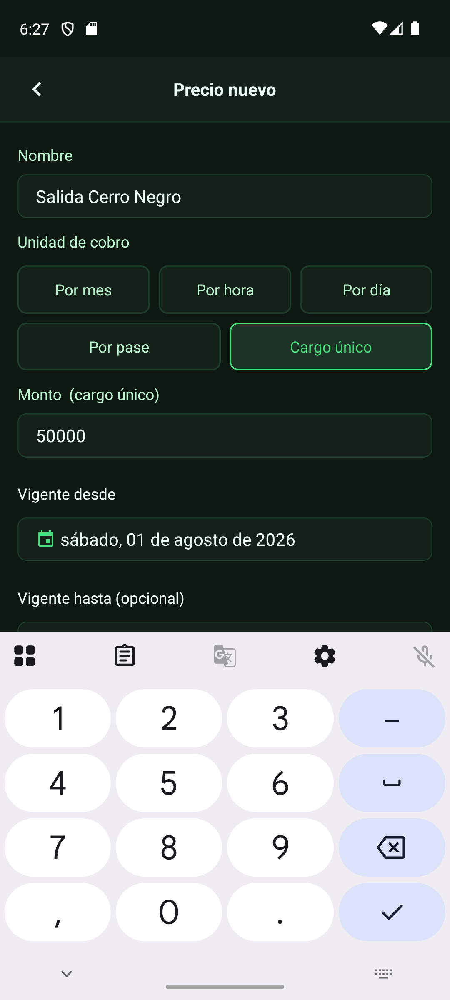{ width="260" }
  <figcaption>Formulario de precio nuevo</figcaption>
</figure>

4. Cargá el monto y la fecha desde la que rige. Guardá — queda creado el concepto con su primer precio vigente.

**Actualizar un precio existente**

1. Andá a `Precios`, tocá el botón de agregar (+) y elegí `Actualizar un precio existente`.
2. Elegí la etiqueta y cargá el nuevo monto — queda vigente desde ese momento, sin pisar los cobros ya registrados con el precio anterior.

## 5. Atribuir un cargo puntual

Para cobros que no son una cuota recurrente ni un pase — una salida, una multa, un arreglo — se le atribuye directamente al socio un cargo único, usando alguno de los conceptos con unidad `Cargo único` (ver [Precios y etiquetas](#4-precios-y-etiquetas)).

<figure markdown>
  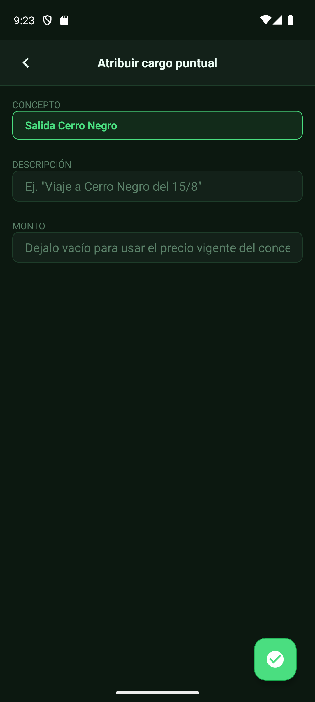{ width="260" }
  <figcaption>Atribuir cargo puntual desde la ficha del socio</figcaption>
</figure>

1. Abrí la ficha del socio y tocá `Atribuir cargo puntual`.
2. Elegí el concepto (solo aparecen los de unidad "único").
3. Si el monto de esta vez es distinto al precio vigente del concepto, cargalo a mano — si lo dejás vacío, usa el precio vigente.
4. Agregá una descripción corta (por ejemplo "Salida Cerro Negro del 15/8") para identificarlo después.
5. Guardá — el cargo queda sumado a la deuda del socio.

Si se cargó por error, se puede anular desde la misma ficha (queda registrado como anulado, no desaparece del historial).

## 6. Advertencias

Un panel único con todos los socios que tienen algo para revisar: cuota social vencida, límite de clases de escuelita superado, o alguna advertencia que saltó en un check-in de muro libre. Se accede desde el ícono de acceso rápido en Inicio.

<figure markdown>
  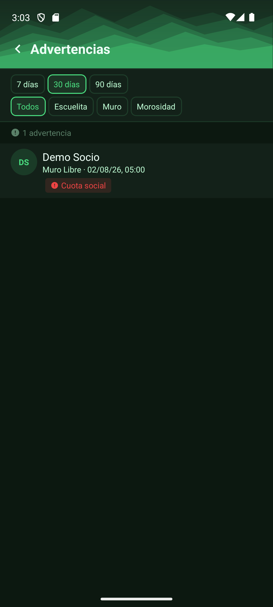{ width="260" }
  <figcaption>Panel de Advertencias, filtrado por período y tipo</figcaption>
</figure>

1. Andá a `Advertencias` desde el grid de Inicio.
2. Filtrá por tipo (`Escuelita` / `Muro` / `Morosidad`), o dejalo en `Todos`. El filtro de período (`7 días` / `30 días` / `90 días`) solo aparece para `Escuelita`, `Muro` y `Todos` — no aplica a `Morosidad`, que se muestra mientras la advertencia siga abierta, sin importar cuándo se detectó.
3. Cada tarjeta muestra el socio, dónde saltó la advertencia y de qué se trata.
4. Si el socio tiene teléfono cargado, aparece un ícono de WhatsApp para escribirle directo desde ahí.

## 7. Suscribir un socio a un plan

Una **Suscripción** es el vínculo entre un socio y un plan — es lo que determina qué le corresponde pagar cada mes. Para **escuelita** se crea sola al inscribir al alumno (ver el manual de [Secretaría](secretaria.md)/[Profesor](profesor.md)); para el resto de los planes (Cuota Social, Muro Libre mensual, etc.) se asigna desde la ficha del socio.

<figure markdown>
  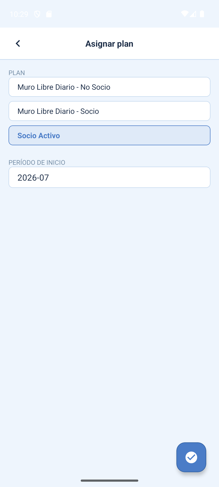{ width="260" }
  <figcaption>Asignar plan desde la ficha del socio</figcaption>
</figure>

**Asignar un plan**

1. Abrí la ficha del socio y tocá `Asignar plan`.
2. Elegí el plan de la lista (solo se muestran planes que no son de escuelita).
3. Confirmá el período de inicio (por defecto, el mes actual).
4. Si el plan elegido está marcado como `No genera deuda` (ver [Planes](#3-planes-crear-planes-nuevos)), se muestra un aviso — esa suscripción no va a generar cuotas.
5. Guardá. Si el socio ya tenía una suscripción activa del mismo tipo de plan, se cierra automáticamente para que no queden dos activas en simultáneo.

**Dar de baja un plan**

1. En la ficha del socio, dentro del detalle de deuda, tocá `Dar de baja` sobre la suscripción que quieras cerrar.
2. Confirmá el período hasta el cual estuvo vigente — a partir de ahí deja de generar deuda nueva.

## 8. Movimientos — caja del club

Es el registro de caja del club: ingresos y egresos que **no** vienen de un cobro de cuota (por ejemplo, una compra de materiales, un gasto de mantenimiento, una donación). Los cobros de cuota generan su propio movimiento automáticamente — acá se cargan los manuales.

<figure markdown>
  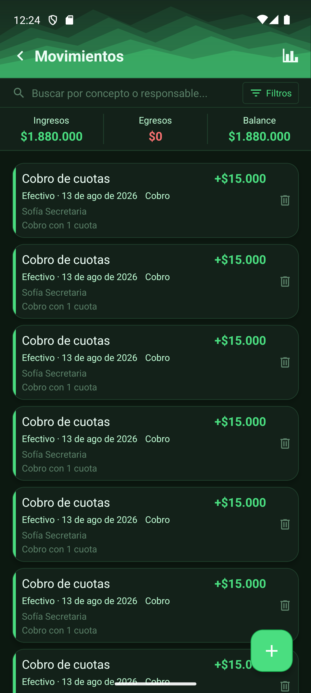{ width="260" }
  <figcaption>Lista de movimientos</figcaption>
</figure>

<figure markdown>
  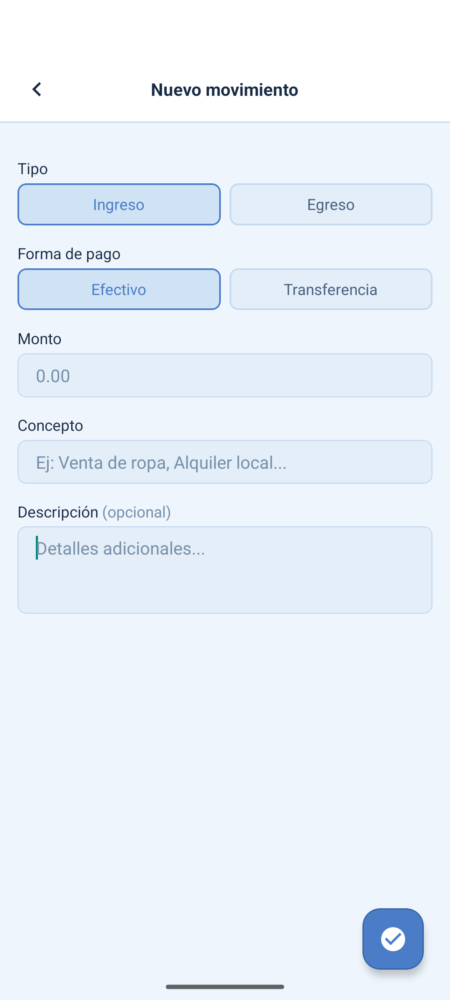{ width="260" }
  <figcaption>Registrar un movimiento</figcaption>
</figure>

**Registrar un movimiento manual**

1. Andá a `Movimientos` y tocá el botón de agregar (+).
2. Elegí si es `Ingreso` o `Egreso`.
3. Elegí la forma de pago (`Efectivo` o `Transferencia`).
4. Cargá el monto, un concepto corto y, si hace falta, una descripción más larga.
5. Confirmá — queda en la lista.

<figure markdown>
  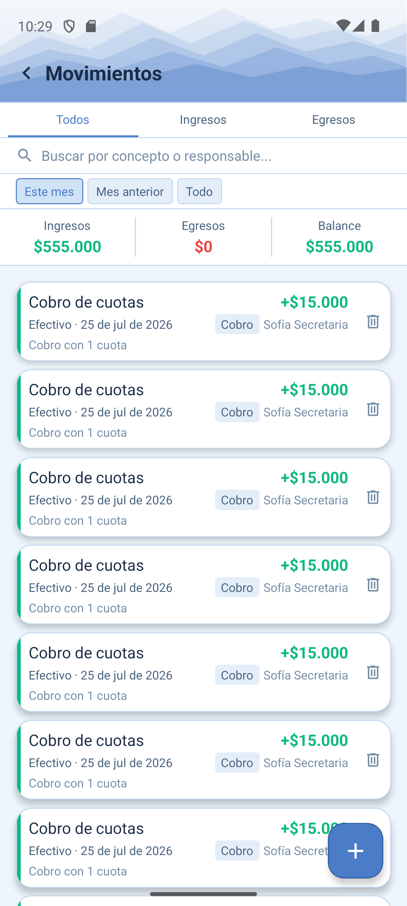{ width="260" }
  <figcaption>Buscador, filtra por concepto o responsable a medida que escribís</figcaption>
</figure>

El buscador (arriba) filtra por concepto o responsable a medida que escribís. Los demás filtros — tipo (`Todos` / `Ingreso` / `Egreso`), período (`Este mes` / `Mes anterior` / `Todo`) y medio de pago — están agrupados detrás del botón `Filtros`, al lado del buscador; un numerito sobre el botón muestra cuántos filtros tenés activos en ese momento. La lista carga de a tandas: al llegar al final se trae más automáticamente.

<figure markdown>
  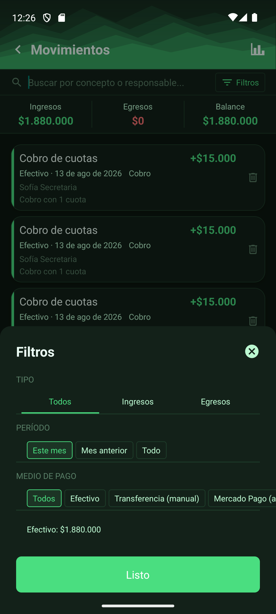{ width="260" }
  <figcaption>Panel de filtros</figcaption>
</figure>

**Resumen de Movimientos**

Tocando el ícono de gráfico de barras en el header de `Movimientos` se abre una pantalla con tres gráficos: ingresos vs. egresos por mes, saldo acumulado, y egresos por categoría — para ver de un vistazo cómo viene la caja del club sin tener que sumar movimiento por movimiento.

<figure markdown>
  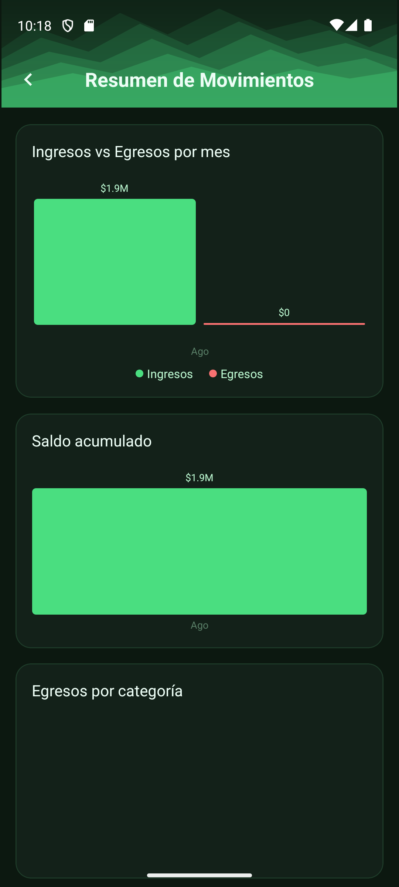{ width="260" }
  <figcaption>Resumen de Movimientos</figcaption>
</figure>

## 9. Horas del staff — deuda a pagar

Profesores y palestreros cargan sus propias horas trabajadas (ver sus manuales). Cada hora se paga según una etiqueta ("Hora Profesor", "Hora Palestrero") con un precio propio — esto es, en la práctica, cómo se calcula qué hay que pagarle al staff cada mes.

<figure markdown>
  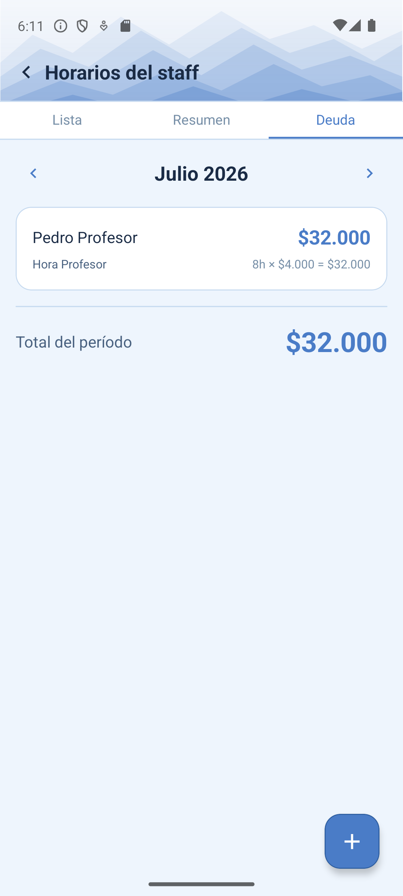{ width="260" }
  <figcaption>Deuda de staff por período</figcaption>
</figure>

**Ver cuánto se le debe pagar al staff en el mes**

1. Andá a `Horarios` y abrí la solapa `Deuda`.
2. Elegí el período (mes/año).
3. Vas a ver, por cada persona de staff, el total de horas cargadas y el monto que corresponde pagarle (horas × precio de su etiqueta).

**Ver el total de horas trabajadas (sin el monto)**

<figure markdown>
  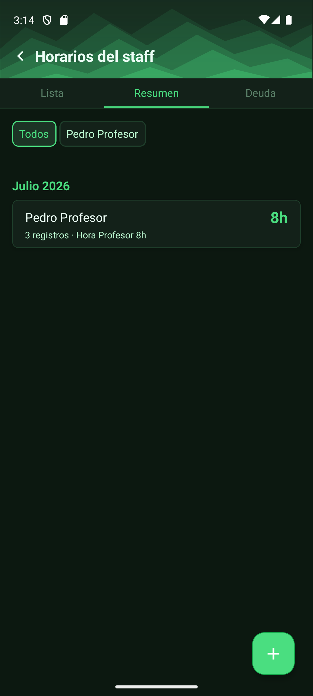{ width="260" }
  <figcaption>Resumen de horas por persona y mes</figcaption>
</figure>

La solapa `Resumen` muestra lo mismo agrupado por mes calendario, con la cantidad de horas y de registros de cada persona — sin el cálculo de a cuánto equivale en pesos. Se puede filtrar por persona con los chips de arriba (`Todos` o una persona puntual).

## 10. Auditoría — historial revertible

Cada cambio importante (crear, editar o borrar un cobro, movimiento, socio, etc.) queda registrado con quién lo hizo y cuándo. Esto es exclusivo del panel de administración web (superadmin), no de la app del celular.

**Revisar y revertir un cambio**

1. En el panel web, andá a `Auditoría`.
2. Tocá "Ver detalle" en cualquier fila para ver qué cambió, campo por campo (antes / después).
3. Si algo se cargó mal, hay una acción para revertirlo — deshace en cascada lo que corresponda (por ejemplo, revertir un cobro también revierte el movimiento y la cuota que generó).

## 11. Exportar a Google Sheets

Actualiza un Google Sheet con los datos del club (socios, cuotas sociales y de escuelita, cobros, escuelita, movimientos, asistencias, muro libre y horarios) — es lo que alimenta el panel que usa la comisión directiva para mirar los números sin entrar a la app.

<figure markdown>
  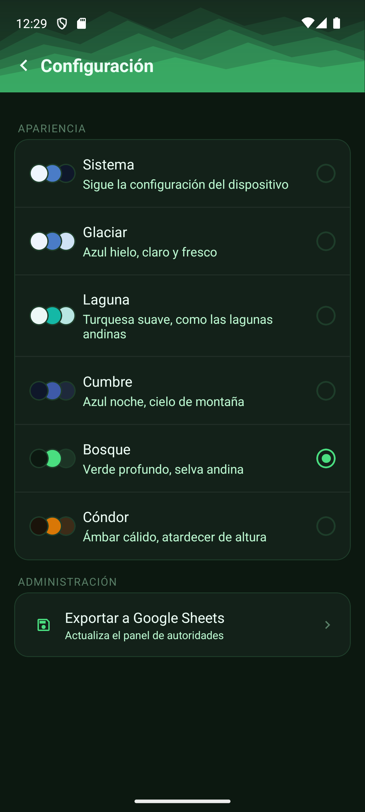{ width="260" }
  <figcaption>Exportar a Google Sheets desde Configuración</figcaption>
</figure>

1. Andá a `Perfil` → `Configuración` → `Exportar a Google Sheets` (dentro de "Administración").
2. Esperá — actualiza cada pestaña del Sheet con los datos actuales del club. La primera vez que se usa, crea la planilla; las siguientes, actualiza la misma.
3. Al terminar muestra "Listo".

!!! warning "Modifica una planilla real y compartida"
    No es una exportación descartable: pisa el contenido de las pestañas del Google Sheet del club cada vez que se corre. Es seguro correrlo cuando haga falta actualizar el panel, pero no es algo para probar "a ver qué hace" sin querer usarlo.

## 12. Notificaciones

Además de las notificaciones personales (ver el [manual de Socio](socio.md#9-notificaciones)), admin y secretaría reciben avisos proactivos del club: alta de un socio nuevo, una solicitud completada por formulario, o un check-in (escuelita/muro libre) con advertencias.

<figure markdown>
  { width="260" }
  <figcaption>Notificaciones — mismo ícono de campana en Inicio para todos los roles</figcaption>
</figure>

Se accede tocando el ícono de campana desde Inicio, igual que para un socio.
