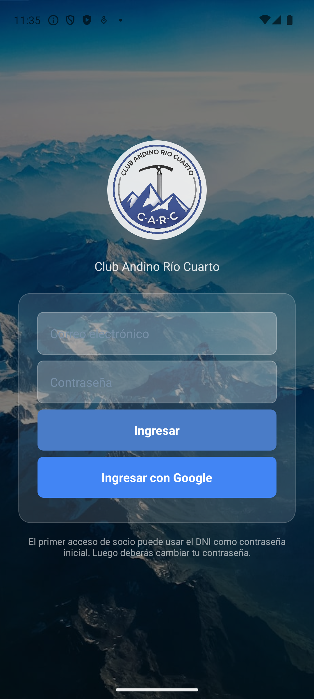
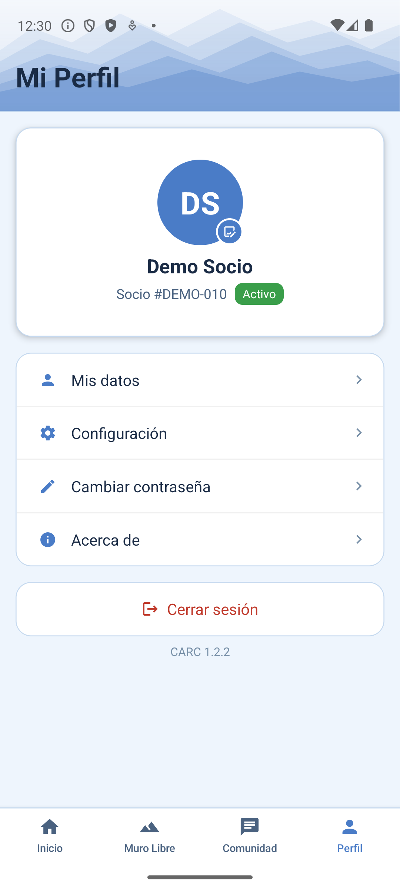
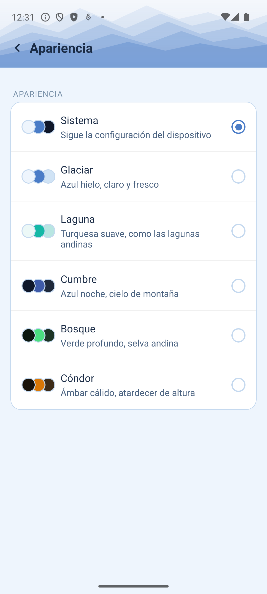

# appClub

**Gestión simple para clubes de montaña**: cuotas y cobros, escuelita, muro libre, credencial digital con QR, novedades del club y control de horas del staff — todo desde el celular, tanto para el equipo del club como para los socios.

!!! success "Ya en uso real"
    En uso real en el **Club Andino Río Cuarto**, con toda su comisión, secretaría, profesores, palestreros y socios.

## Elegí un rol para ver su manual y probarlo

Cada rol tiene su propio login de prueba en un club demo (con datos ficticios, que se reinicia solo todos los días) y su propio manual paso a paso.

-   :material-cards-heart:{ .lg .middle } **Socio**

    ---

    Cuotas y pago, credencial digital, novedades del club y notificaciones.

    [:octicons-arrow-right-24: Ver manual de Socio](socio.md)

-   :material-wall:{ .lg .middle } **Palestrero**

    ---

    Check-in y cobro del pase de muro libre, y carga de horas propias.

    [:octicons-arrow-right-24: Ver manual de Palestrero](palestrero.md)

-   :material-school:{ .lg .middle } **Profesor**

    ---

    Alumnos de escuelita, toma de asistencia clase a clase y carga de horas propias.

    [:octicons-arrow-right-24: Ver manual de Profesor](profesor.md)

-   :material-clipboard-text:{ .lg .middle } **Secretaría**

    ---

    El día a día: cobros de cuota, inscripción a escuelita, check-in de muro libre y novedades del club.

    [:octicons-arrow-right-24: Ver manual de Secretaría](secretaria.md)

-   :material-briefcase:{ .lg .middle } **Admin / Autoridad**

    ---

    Alta y baja de socios, planes y precios, reportes de deuda del staff, y auditoría revertible de cualquier cambio.

    [:octicons-arrow-right-24: Ver manual de Admin](admin.md)

## Cómo entrar

Desde el navegador (funciona en iPhone y en cualquier computadora):

[:material-web: Entrar desde el navegador](https://raspberrypi.tail703951.ts.net/app/login){ .md-button .md-button--primary }
[:material-cellphone-arrow-down: Descargar la app nativa (Android)](https://raspberrypi.tail703951.ts.net/download/){ .md-button }

Desde Safari en iPhone podés además "Agregar a inicio" para tenerla como una app más.

Los datos del club de prueba son ficticios y se reinician automáticamente todos los días — probá lo que quieras, sin miedo a romper nada.

### La pantalla de login

Es bien simple: correo electrónico y contraseña.

<figure markdown>
  { width="260" }
  <figcaption>Pantalla de login</figcaption>
</figure>

- **Primer acceso de un socio real:** la contraseña inicial es su **DNI**. Al entrar por primera vez, la app pide cambiarla por una propia.
- **Roles de prueba (demo):** usá directamente el email y la contraseña que te dimos en cada manual — ya están listos, sin paso adicional.
- En la app nativa (no en el navegador) también existe la opción de entrar con Google.

## Tu perfil y personalización

Esto es igual para cualquier rol — se accede desde la solapa `Perfil`, abajo a la derecha.

<figure markdown>
  { width="260" }
  <figcaption>Mi Perfil</figcaption>
</figure>

- **Foto de perfil:** tocá tu avatar (círculo con tus iniciales) para elegir una foto de tu galería, o para quitarla si ya tenés una puesta.
- **Mis datos:** tus datos personales (nombre, contacto, etc.).
- **Configuración → Apariencia:** appClub trae 6 temas de color para elegir, además de "Sistema" (que sigue el modo claro/oscuro del celular).
- **Cambiar contraseña** y **Acerca de** (info de la app y cómo apoyar su desarrollo).

<figure markdown>
  { width="260" }
  <figcaption>Apariencia — 6 temas a elegir</figcaption>
</figure>

!!! tip "¿Ya sos del Club Andino Río Cuarto?"
    No hace falta usar las credenciales de prueba: entrá con tu usuario real y vas a encontrar las mismas pantallas que se explican en cada manual, con los datos reales del club.

## Apoyá el desarrollo

appClub es un proyecto desarrollado de forma independiente por un socio del club, en su tiempo libre, con el objetivo de que la gestión del CARC (y de otros clubes de montaña) sea un poco más simple para todos.

Si te resulta útil y querés colaborar para que siga creciendo (nuevas funciones, mantenimiento, hosting), podés invitar un cafecito. Cualquier aporte ayuda un montón.

[:material-coffee: Invitame un cafecito](https://cafecito.app/nicopelos){ .md-button }
