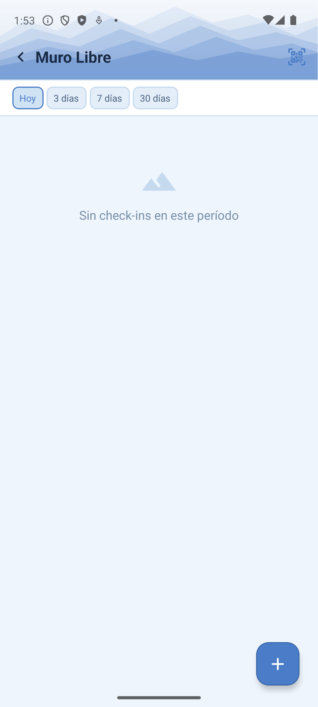
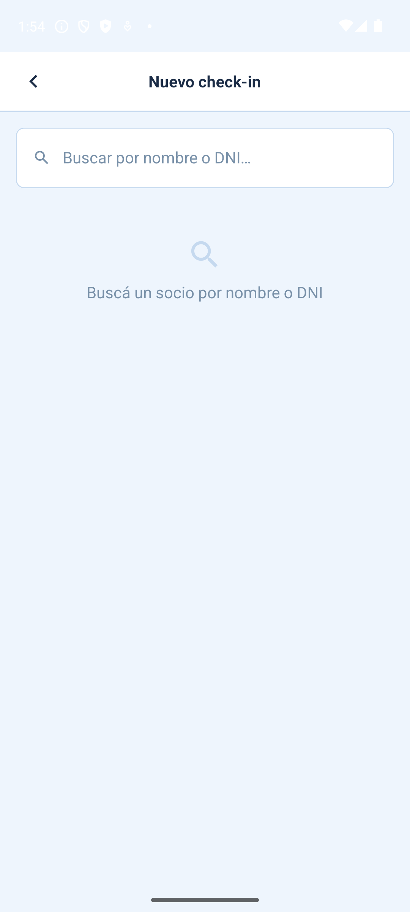
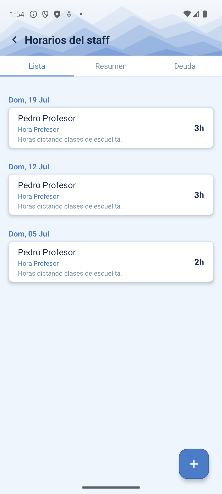

# Manual de Palestrero

El rol **Palestrero** es quien atiende el muro de escalada libre: registra cada visita (de socios y de gente externa), cobra el pase diario en el momento, y carga sus propias horas trabajadas.

```text title="Login de prueba"
palestrero@demo.appclub.ar / DemoPalestrero2026!
```

!!! tip "¿Sos palestrero en el CARC?"
    Entrá con tu usuario real desde [/app/login](https://raspberrypi.tail703951.ts.net/app/login) para ver el muro real y tus propias horas.

## 1. Check-in de muro libre y cobro del pase

Cada visita al muro (sea de un socio o de alguien externo) se registra acá, junto con si paga pase **diario** o **mensual**, y si ya está pagado o queda pendiente.

<figure markdown>
  { width="260" }
  <figcaption>Check-ins del día</figcaption>
</figure>

<figure markdown>
  { width="260" }
  <figcaption>Nuevo check-in</figcaption>
</figure>

1. Andá a `Muro Libre` y tocá el botón de agregar (+).
2. Buscá a la persona por nombre o DNI. Si ya es socio, va a aparecer en los resultados con su estado.
3. Elegí el tipo de pase: `diario` o `mensual`. Si ya tiene un pase mensual vigente, la app te avisa antes de cobrarle de más.
4. Elegí el estado de pago: `pagado` o `pendiente`.
5. Si está pagado, elegí la forma de pago (`Efectivo` / `Transferencia`).
6. Confirmá — queda el check-in con fecha y hora.

## 2. Cargar tus horas trabajadas

Igual que el profesor, cada hora que cargás queda asociada a tu nombre y a tu etiqueta de pago ("Hora Palestrero"), y así el admin sabe cuánto corresponde pagarte cada mes.

<figure markdown>
  { width="260" }
  <figcaption>Horas cargadas</figcaption>
</figure>

1. Andá a `Horarios` y tocá el botón de agregar (+).
2. Elegí la fecha, la hora de entrada y de salida.
3. Elegí el tipo de tarea (por ejemplo, "atención del muro").
4. Confirmá — el formulario es el mismo que usa un profesor, solo cambia la etiqueta de pago.
