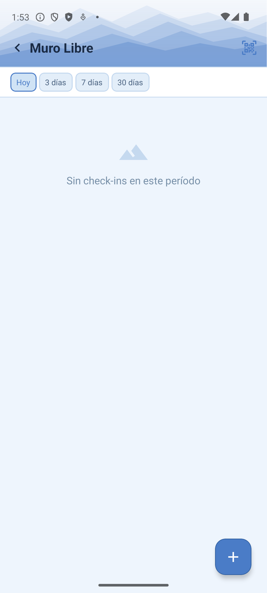
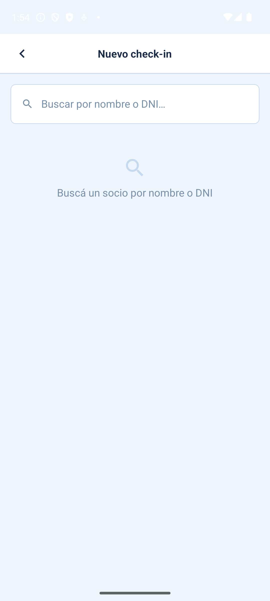
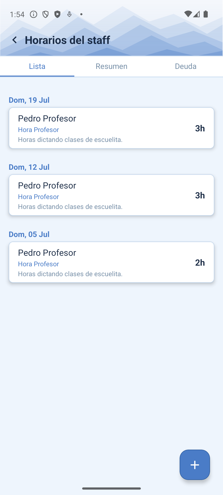

# Manual de Palestrero

El rol **Palestrero** es quien atiende el muro de escalada libre: registra cada visita (de socios y de gente externa), cobra el pase diario en el momento, y carga sus propias horas trabajadas.

```text title="Login de prueba"
palestrero@demo.appclub.ar / DemoPalestrero2026!
```

!!! tip "¿Sos palestrero en el CARC?"
    Entrá con tu usuario real desde [/app/login](https://raspberrypi.tail703951.ts.net/app/login) para ver el muro real y tus propias horas.

## 1. Check-in de muro libre y cobro del pase

Cada visita al muro (sea de un socio o de alguien externo) se registra acá, junto con si paga pase **diario** o **mensual**, y si ya está pagado o queda pendiente.

<figure markdown>
  { width="260" }
  <figcaption>Check-ins del día</figcaption>
</figure>

<figure markdown>
  { width="260" }
  <figcaption>Nuevo check-in</figcaption>
</figure>

Arriba de la lista hay chips para filtrar lo que se muestra (`Hoy`, `3 días`, `7 días`, `30 días`), con el total de check-ins del período a la derecha.

La mayoría de los check-ins de socios se cargan solos: en la pared del club hay un cartel fijo con un código QR de Muro Libre, y el socio lo escanea con la cámara de su propio celular (no hace falta que abra la app primero). Si tiene pase mensual vigente no se le genera ningún cargo; si no, queda pendiente de pago y lo cobrás vos en el mostrador cuando corresponda.

Para gente externa (que no es socio) o si preferís cargar el check-in vos mismo/a:

1. Andá a `Muro Libre` y tocá el botón de agregar (+).
2. Buscá a la persona por nombre o DNI. Los resultados muestran nombre y DNI — el estado del pase mensual (si lo tiene vigente o vencido) aparece recién al tocar a la persona, no en la lista. Si no aparece nadie, tocá el link para registrarla como visitante externo y cargá nombre (obligatorio), apellido y DNI (opcionales).
3. Elegí la fecha del check-in.
4. Elegí el tipo de pase: `diario` o `mensual`. El pase mensual solo está disponible para socios — a una persona externa solo se le puede cobrar el diario.
   Si el socio elegido ya tiene un pase mensual vigente, la app lo detecta sola: fija el tipo en `mensual` (no lo podés cambiar a `diario`) y el estado de pago queda automático — `exento` si el pase está vigente, `pendiente` si venció. En ese caso los pasos 5 a 7 no aparecen.
5. Elegí el estado de pago: `pagado`, `pendiente` o `exento`.
6. Si está pagado, elegí la forma de pago (`Efectivo` / `Transferencia`).
7. Si el pase es `diario` y quedó `pagado`, aparece el campo **Monto**: viene precargado con el precio sugerido (distinto si es socio o externo), pero se puede editar antes de confirmar.
8. Opcional: agregá una observación en el campo de texto libre al final del formulario.
9. Confirmá — queda el check-in con fecha y hora.

Para corregir un check-in ya cargado (por ejemplo si te equivocaste de tipo de pase o forma de pago), tocá el lápiz en su fila de la lista; el tacho de al lado lo elimina.

Si no tenés el cartel QR a mano (se rompió, se lo llevaron, etc.), tocá el ícono de QR (arriba a la derecha) para generarlo e imprimirlo de nuevo.

## 2. Cargar tus horas trabajadas

Igual que el profesor, cada hora que cargás queda asociada a tu nombre, y así el admin sabe cuánto corresponde pagarte cada mes.

<figure markdown>
  { width="260" }
  <figcaption>Horas cargadas</figcaption>
</figure>

1. Andá a `Horarios` y tocá el botón de agregar (+).
2. Elegí la fecha, la hora de entrada y de salida.
3. Elegí el tipo de tarea — la lista muestra todas las etiquetas de hora del club, así que elegí la que te corresponde a vos (por ejemplo, "Hora Palestrero").
4. Confirmá — el formulario es el mismo que usa un profesor, solo cambia qué etiqueta corresponde pagarte.

La pantalla también tiene una solapa `Resumen`, con el total de horas que cargaste cada mes agrupado por tipo de tarea. Y una solapa `Deuda`, que traduce esas horas a plata según el precio configurado — cuánto te corresponde cobrar.

## 3. Notificaciones

Tocando el ícono de campana desde Inicio se ven tus notificaciones personales. Hoy los avisos proactivos del club (alta de socio, check-in con advertencias) están dirigidos a secretaría — ver el [manual de Admin](admin.md#12-notificaciones).
