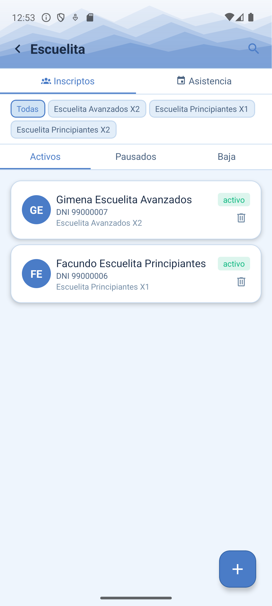
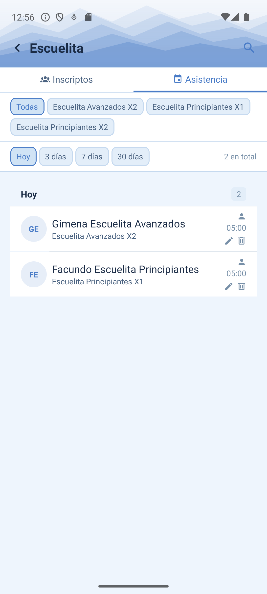
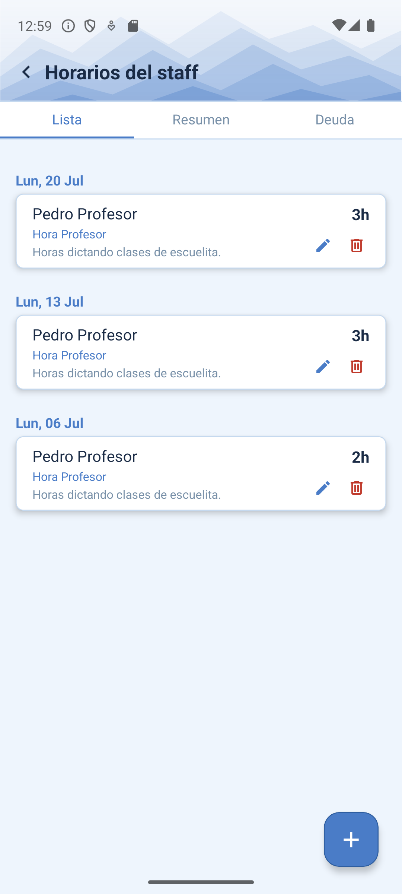
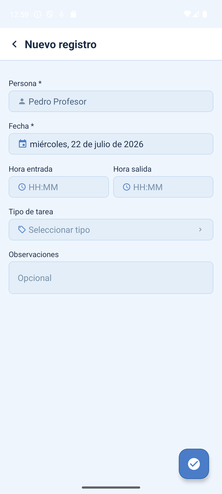

# Manual de Profesor

El rol **Profesor** está pensado para quien dicta clases de escuelita: ver a sus alumnos, tomar asistencia clase a clase y cargar sus propias horas trabajadas (de ahí sale lo que el club le paga). No ve cobros ni maneja caja.

```text title="Login de prueba"
profesor@demo.appclub.ar / DemoProfesor2026!
```

!!! tip "¿Sos profesor en el CARC?"
    Entrá con tu usuario real desde [/app/login](https://raspberrypi.tail703951.ts.net/app/login) para ver tus propios alumnos y tus propias horas.

## 1. Ver tus alumnos y su plan

La pantalla de **Escuelita** muestra a todos los alumnos inscriptos, con el plan de cada uno (por ejemplo "Principiantes X1" o "Avanzados X2" — eso define cuántas clases por semana le corresponden). Se puede filtrar por plan y por estado (`Activos / Pausados / Baja`).

<figure markdown>
  { width="260" }
  <figcaption>Alumnos inscriptos</figcaption>
</figure>

## 2. Tomar asistencia

Cada clase dictada se registra como una asistencia. La solapa `Asistencia` muestra el historial reciente; el ícono de buscar (arriba a la derecha) abre el buscador para registrar una nueva.

<figure markdown>
  { width="260" }
  <figcaption>Historial de asistencias</figcaption>
</figure>

1. Andá a `Escuelita` → solapa `Asistencia`.
2. Tocá la lupa (arriba a la derecha) y buscá al alumno por nombre, DNI, o escaneá su credencial QR.
3. Al confirmarlo, te muestra cuántas clases lleva esa semana sobre el total de su plan (por ejemplo "2/2 esta semana") y cualquier advertencia (cuota vencida, plan pausado, etc.).

## 3. Cargar tus horas trabajadas

Cada hora que cargás queda asociada a tu nombre y a una etiqueta de pago ("Hora Profesor"). Con eso, el admin puede ver cuánto corresponde pagarte cada mes (ver su manual, sección [Horas del staff](admin.md#6-horas-del-staff-deuda-a-pagar)).

<figure markdown>
  { width="260" }
  <figcaption>Tus horas cargadas</figcaption>
</figure>

<figure markdown>
  { width="260" }
  <figcaption>Cargar un registro nuevo</figcaption>
</figure>

1. Andá a `Horarios` y tocá el botón de agregar (+).
2. Elegí la fecha del turno trabajado.
3. Cargá la hora de entrada y de salida — la app calcula las horas totales.
4. Elegí el tipo de tarea (por ejemplo, "clases de escuelita").
5. Agregá una observación si hace falta, y confirmá.
