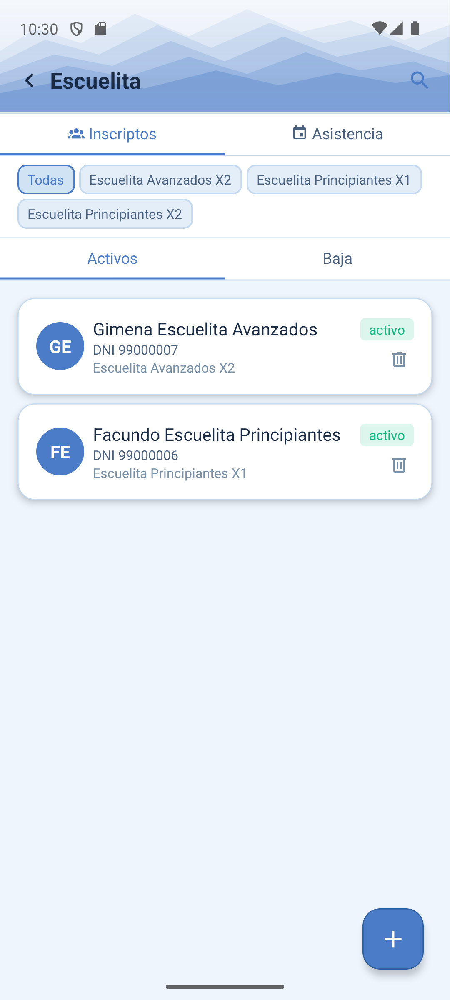
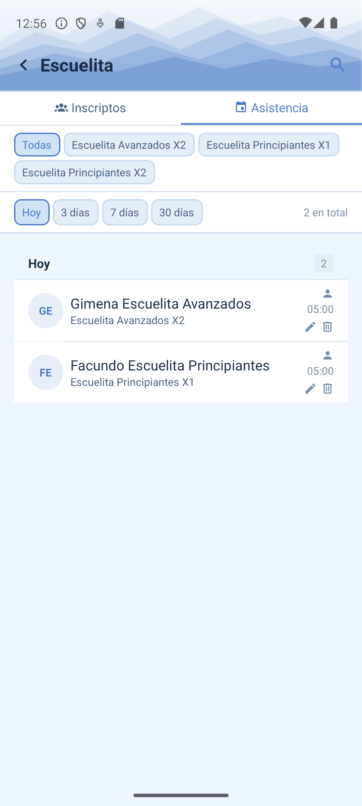
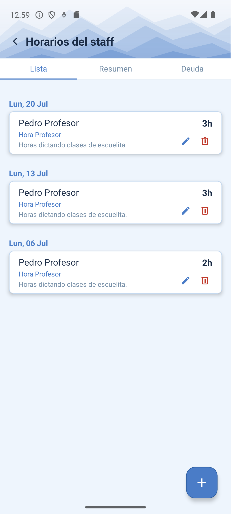
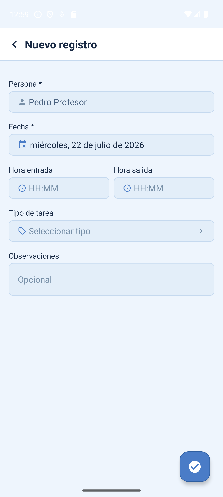

# Manual de Profesor

El rol **Profesor** está pensado para quien dicta clases de escuelita: ver a sus alumnos, tomar asistencia clase a clase y cargar sus propias horas trabajadas (de ahí sale lo que el club le paga). No ve cobros ni maneja caja.

```text title="Login de prueba"
profesor@demo.appclub.ar / DemoProfesor2026!
```

!!! tip "¿Sos profesor en el CARC?"
    Entrá con tu usuario real desde [/app/login](https://raspberrypi.tail703951.ts.net/app/login) para ver tus propios alumnos y tus propias horas.

## 1. Ver tus alumnos y su plan

La pantalla de **Escuelita** muestra a todos los alumnos inscriptos, con el plan de cada uno (por ejemplo "Principiantes X1" o "Avanzados X2" — eso define cuántas clases por semana le corresponden). Se puede filtrar por plan.

<figure markdown>
  { width="260" }
  <figcaption>Alumnos inscriptos</figcaption>
</figure>

Tocando a un alumno se abre su ficha completa: datos del socio (nombre, DNI, N° de socio, fecha de inscripción), plan, deuda de cuota de escuelita y asistencias recientes — ver el [manual de Secretaría](secretaria.md#2-inscribir-un-alumno-a-la-escuelita) para el detalle.

## 2. Tomar asistencia

Cada clase dictada se registra como una asistencia. La mayoría se cargan solas: cada alumno (o su tutor) escanea con la cámara de su propio celular el cartel QR fijo de Escuelita pegado en la pared del club, sin necesidad de abrir la app antes — si es el alumno, queda registrado directo; si es un tutor con más de un hijo inscripto, la app le pregunta a cuál marcar.

La solapa `Asistencia` muestra el historial reciente; el ícono de buscar (arriba a la derecha) abre el buscador para cargar una asistencia a mano, como respaldo.

<figure markdown>
  { width="260" }
  <figcaption>Historial de asistencias</figcaption>
</figure>

1. Andá a `Escuelita` → solapa `Asistencia`.
2. Tocá la lupa (arriba a la derecha) y buscá al alumno por nombre o DNI.
3. Se abre una pantalla para confirmar la fecha (por defecto, hoy) — tocá `Registrar`.
4. Te muestra cuántas clases lleva esa semana sobre el total de su plan (por ejemplo "2/2 esta semana") y cualquier advertencia (cuota social o de escuelita impaga, límite semanal alcanzado, etc.).

Si no tenés el cartel a mano, tocá el ícono de QR (junto a la lupa) para generarlo e imprimirlo de nuevo.

## 3. Cargar tus horas trabajadas

Cada hora que cargás queda asociada a tu nombre y a una etiqueta de pago ("Hora Profesor"). Con eso, el admin puede ver cuánto corresponde pagarte cada mes (ver su manual, sección [Horas del staff](admin.md#9-horas-del-staff-deuda-a-pagar)).

<figure markdown>
  { width="260" }
  <figcaption>Tus horas cargadas</figcaption>
</figure>

<figure markdown>
  { width="260" }
  <figcaption>Cargar un registro nuevo</figcaption>
</figure>

1. Andá a `Horarios` y tocá el botón de agregar (+).
2. Elegí la fecha del turno trabajado.
3. Cargá la hora de entrada y de salida — la app calcula las horas totales.
4. Elegí el tipo de tarea — para un profesor suele ser "Hora Profesor" (esa etiqueta es la que define la tarifa por hora que te paga el club, no el tipo de clase dictada).
5. Agregá una observación si hace falta, y confirmá.

En la lista de tus registros, cada uno tiene un lápiz y un tacho al lado para editarlo o borrarlo si cargaste algo mal.

La pantalla también tiene una solapa `Resumen`, con el total de horas que cargaste cada mes agrupado por tipo de tarea — útil para llevar la cuenta antes de que cierre el mes.

## 4. Notificaciones

Tocando el ícono de campana desde Inicio se ven tus notificaciones personales. Hoy los avisos proactivos del club (alta de socio, check-in con advertencias) están dirigidos a secretaría — ver el [manual de Admin](admin.md#12-notificaciones).
