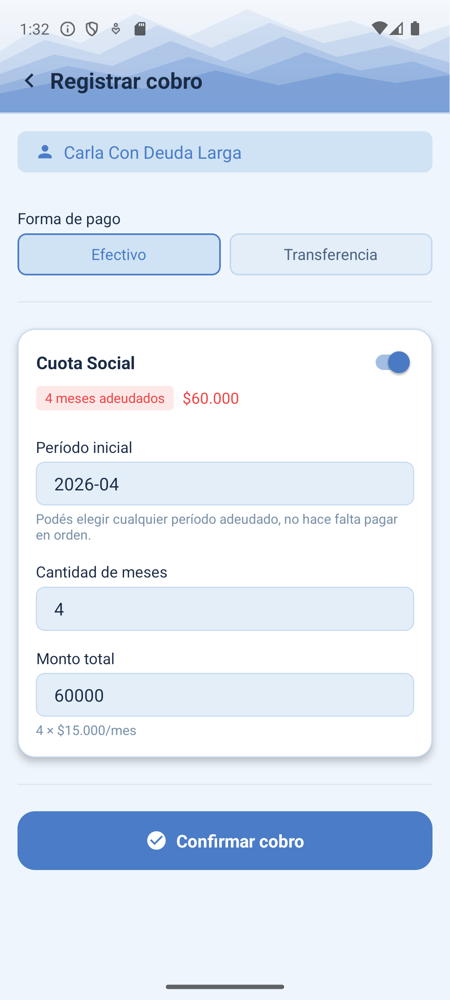
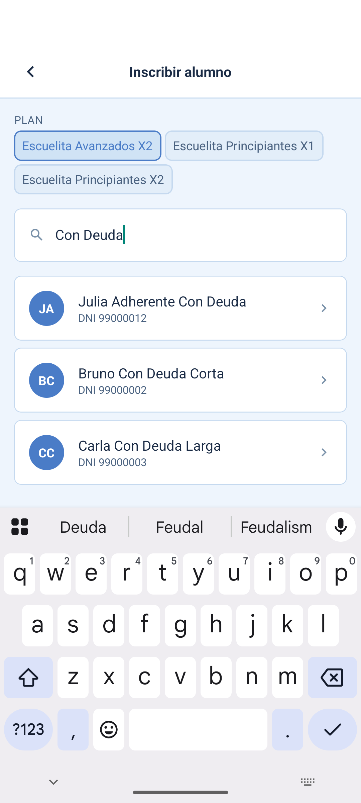
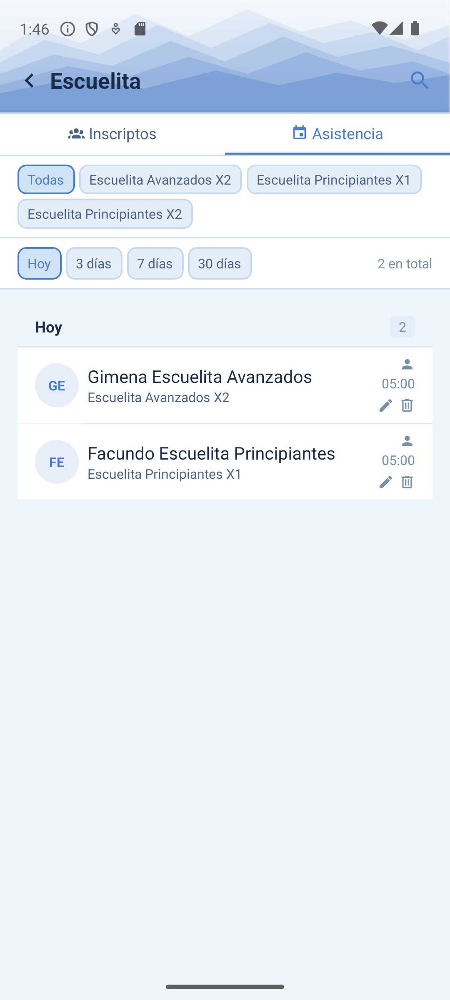
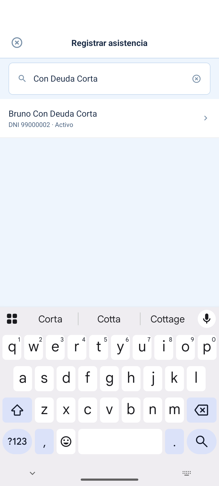
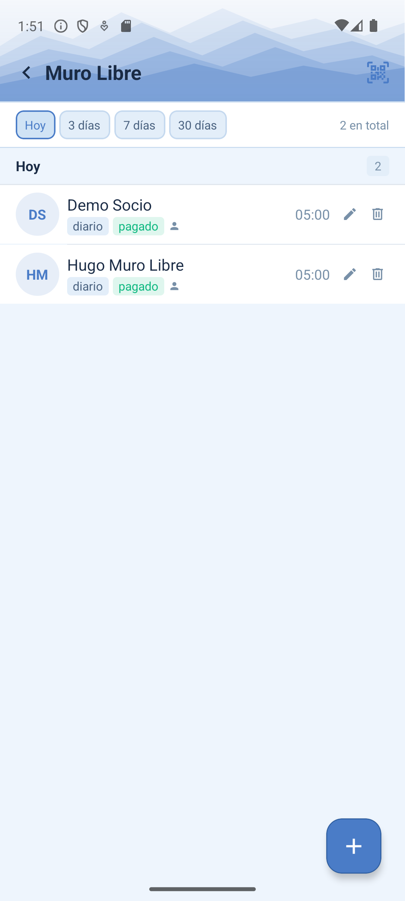
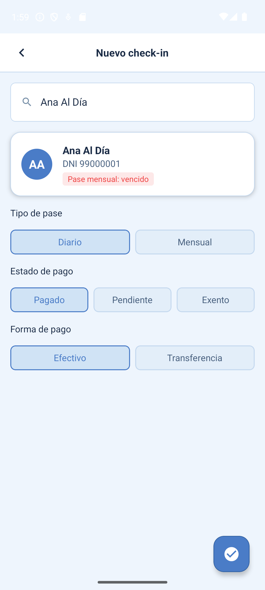

# Manual de Secretaría

**Secretaría** es el rol del día a día: quien atiende en el club, cobra las cuotas, inscribe alumnos a la escuelita, hace el check-in de muro libre y publica novedades. Tiene casi los mismos permisos que Admin, pero no puede gestionar usuarios ni ver la auditoría completa.

```text title="Login de prueba"
secretaria@demo.appclub.ar / DemoSecretaria2026!
```

!!! tip "¿Trabajás en secretaría del CARC?"
    Entrá con tu usuario real desde [/app/login](https://raspberrypi.tail703951.ts.net/app/login) para ver estas mismas pantallas con los socios reales del club.

## 1. Registrar el cobro de una cuota

Cuando un socio paga (cuota social, escuelita o muro libre mensual), se registra desde su ficha. El sistema calcula solo qué meses tiene pendientes.

<figure markdown>
  { width="260" }
  <figcaption>Registrar un cobro</figcaption>
</figure>

1. Buscá al socio (por nombre o DNI) y entrá a su ficha.
2. Tocá "Registrar cobro" — vas a ver una lista con cada cuota que tiene activa (social, escuelita, etc.) y cuánto adeuda de cada una.
3. Activá las cuotas que está pagando ahora.
4. Para cada una, revisá el período (`AAAA-MM`) desde el que empieza a pagar y cuántos meses cubre.
5. Si paga un monto distinto al sugerido, podés ajustarlo a mano.
6. Elegí la forma de pago (`Efectivo` o `Transferencia`).
7. Confirmá — se genera el cobro, y automáticamente el movimiento de caja correspondiente.

## 2. Inscribir un alumno a la escuelita

Al inscribir a alguien en un plan de escuelita, appClub crea automáticamente su suscripción — es el único caso hoy en que esto pasa solo (para otros planes, ver el [manual de Admin](admin.md#4-suscribir-un-socio-a-un-plan)).

<figure markdown>
  { width="260" }
  <figcaption>Elegir plan y buscar al socio</figcaption>
</figure>

1. Andá a `Escuelita` → solapa `Inscriptos`.
2. Tocá el botón de agregar (+).
3. Elegí el plan (por ejemplo "Principiantes X1" o "Avanzados X2") — de eso depende cuántas clases por semana le corresponden.
4. Buscá al socio por nombre o DNI y tocalo en los resultados.
5. Queda inscripto como `activo` y aparece en la lista de inscriptos con su plan.

Si un alumno deja de asistir temporalmente, se lo puede pasar a `pausado` desde su ficha (solapa `Pausados`) sin darlo de baja del todo.

## 3. Tomar asistencia de escuelita

Cada clase a la que asiste un alumno queda registrada. Esto es lo que después le permite al profesor y al admin ver el historial real de clases dictadas.

<figure markdown>
  { width="260" }
  <figcaption>Asistencias del día</figcaption>
</figure>

<figure markdown>
  { width="260" }
  <figcaption>Buscar alumno (o escanear su QR)</figcaption>
</figure>

1. Andá a `Escuelita` → solapa `Asistencia`.
2. Tocá el botón para registrar asistencia y buscá al alumno por DNI (o escaneá su credencial QR).
3. Al confirmarlo, la app muestra cuántas clases lleva esa semana sobre el total que le corresponde según su plan (por ejemplo "2/2 esta semana").
4. Si ya superó el límite de su plan, o tiene una advertencia pendiente (por ejemplo cuota vencida), te avisa en el momento.

## 4. Check-in de muro libre

Registra cada visita al muro de escalada, sea de un socio o de alguien externo, y si corresponde, cobra el pase en el momento.

<figure markdown>
  { width="260" }
  <figcaption>Check-ins del día</figcaption>
</figure>

<figure markdown>
  { width="260" }
  <figcaption>Cargar el check-in</figcaption>
</figure>

1. Andá a `Muro Libre` y tocá el botón de agregar (+).
2. Buscá a la persona por nombre o DNI (si ya es socio, aparece en los resultados).
3. Elegí el tipo de pase: `diario` o `mensual`. Si ya tiene un pase mensual vigente, la app te lo muestra antes de cobrar de más.
4. Elegí el estado de pago: `pagado` o `pendiente`.
5. Si está pagado, elegí la forma de pago (`Efectivo` / `Transferencia`).
6. Confirmá — queda el check-in registrado con fecha y hora.

## 5. Movimientos de caja

Para ingresos o egresos que no vienen de un cobro (compras, gastos varios). Los pasos son idénticos a los del [manual de Admin](admin.md#5-movimientos-caja-del-club).

## 6. Novedades del club

Son los anuncios que ven los socios en su pantalla de inicio y en "Comunidad" (salidas, eventos, avisos). Hoy se completan de dos formas: sincronización automática (Instagram del club, o RSS de una federación) y carga manual.

!!! warning "Limitación conocida"
    Aunque el permiso para publicar una novedad manual existe, todavía no hay ninguna pantalla (ni en la app ni en el panel web) para hacerlo — hoy se resuelve por fuera de la app. Ya está anotado como pendiente ([issue #9](https://github.com/NicoPelos/appCARC-mobile/issues/9)).
