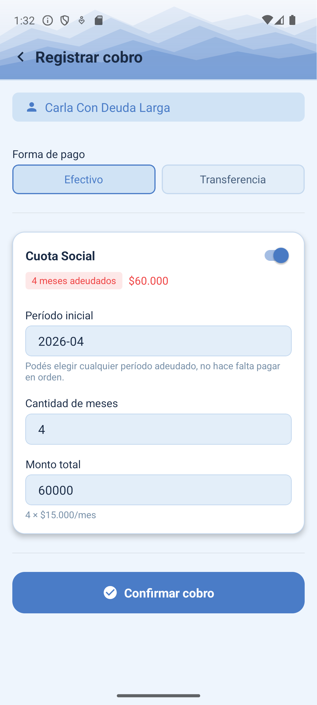
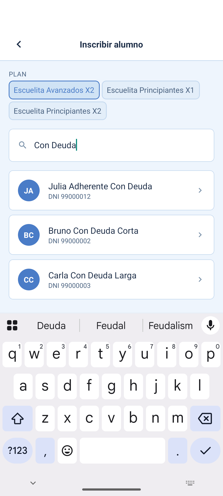
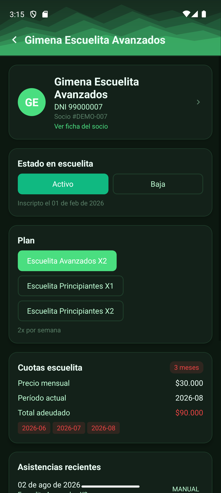
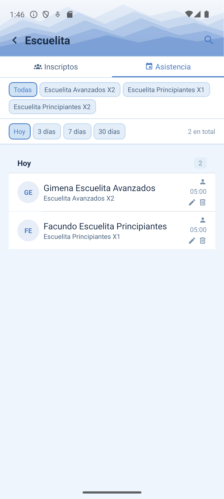
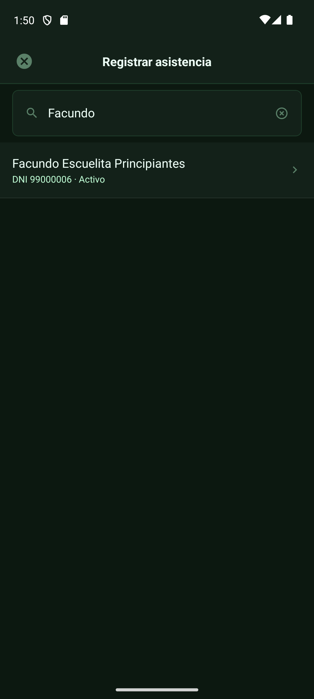
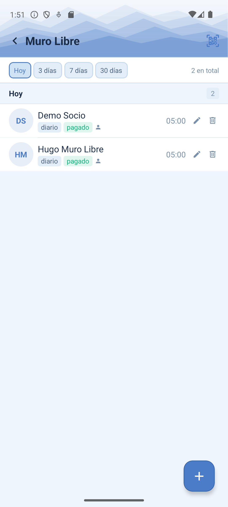
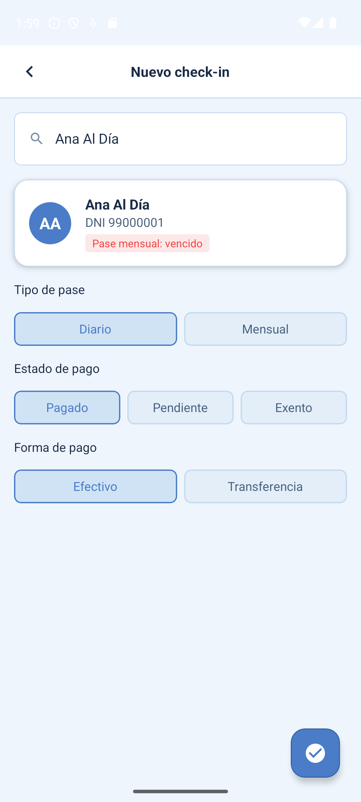

# Manual de Secretaría

**Secretaría** es el rol del día a día: quien atiende en el club, cobra las cuotas, inscribe alumnos a la escuelita, hace el check-in de muro libre y publica novedades. Tiene casi los mismos permisos que Admin, pero no puede gestionar usuarios ni ver la auditoría completa.

```text title="Login de prueba"
secretaria@demo.appclub.ar / DemoSecretaria2026!
```

!!! tip "¿Trabajás en secretaría del CARC?"
    Entrá con tu usuario real desde [/app/login](https://raspberrypi.tail703951.ts.net/app/login) para ver estas mismas pantallas con los socios reales del club.

## 1. Registrar el cobro de una cuota

Cuando un socio paga (cuota social, escuelita o muro libre mensual), se registra desde su ficha. El sistema calcula solo qué meses tiene pendientes.

<figure markdown>
  { width="260" }
  <figcaption>Registrar un cobro</figcaption>
</figure>

1. Buscá al socio (por nombre o DNI) y entrá a su ficha.
2. Tocá "Registrar cobro". Arriba de todo vas a ver la "Fecha del cobro" (por defecto hoy, editable si necesitás cargar un cobro retroactivo) y la forma de pago (`Efectivo` o `Transferencia`).
3. Debajo, una sección por cada concepto pendiente del socio: una por cada cuota que tiene activa (social, escuelita, etc.), y si corresponde, una de "Muro Libre" (visitas sin pase mensual vigente) y una por cada cargo puntual atribuido (por ejemplo, una salida). Activá las que está pagando ahora con el interruptor de cada sección.
4. Según el tipo de sección: en una cuota, tildá los períodos que corresponda entre los chips de meses adeudados — vienen todos tildados por defecto, pero podés destildar cualquiera, no hace falta que sean consecutivos; en Muro Libre, ingresá la cantidad de visitas que está pagando; en un cargo puntual, el monto se carga directo.
5. Si paga un monto distinto al sugerido, podés ajustarlo a mano.
6. Confirmá — se genera el cobro, y automáticamente el movimiento de caja correspondiente.

**Alternativa: cobrar por Mercado Pago.** En vez de confirmar el cobro manual, podés tocar "Generar link de pago" — arma un link de Mercado Pago con los mismos ítems tildados, para mandarle al socio. El cobro se registra solo, automáticamente, cuando el socio efectivamente paga.

## 2. Inscribir un alumno a la escuelita

Al inscribir a alguien en un plan de escuelita, appClub crea automáticamente su suscripción — es el único caso hoy en que esto pasa solo (para otros planes, ver el [manual de Admin](admin.md#7-suscribir-un-socio-a-un-plan)).

<figure markdown>
  { width="260" }
  <figcaption>Elegir plan y buscar al socio</figcaption>
</figure>

1. Andá a `Escuelita` → solapa `Inscriptos`.
2. Tocá el botón de agregar (+).
3. Elegí el plan (por ejemplo "Principiantes X1" o "Avanzados X2") — de eso depende cuántas clases por semana le corresponden.
4. Buscá al socio por nombre o DNI y tocalo en los resultados.
5. Queda inscripto como `activo` y aparece en la lista de inscriptos con su plan.

Si un alumno deja de asistir a escuelita, se lo da de baja tocando el ícono de tacho en su fila, desde la lista de inscriptos — queda registrado como `baja` (no borra su historial) y sale de la lista de activos. Si vuelve más adelante, se lo puede reinscribir de nuevo.

**La ficha del alumno**

Tocando a un alumno en la lista de inscriptos se abre su ficha: perfil, plan (con la opción de cambiarlo), cuánto adeuda de cuota de escuelita (con los períodos pendientes) y sus asistencias recientes. La ficha no muestra un estado activo/baja ni tiene la acción de dar de baja — eso se hace desde la lista, como se explicó arriba.

<figure markdown>
  { width="260" }
  <figcaption>Ficha del alumno: perfil, plan, deuda y asistencias</figcaption>
</figure>

## 3. Tomar asistencia de escuelita

Cada clase a la que asiste un alumno queda registrada. Esto es lo que después le permite al profesor y al admin ver el historial real de clases dictadas.

<figure markdown>
  { width="260" }
  <figcaption>Asistencias del día</figcaption>
</figure>

<figure markdown>
  { width="260" }
  <figcaption>Buscar alumno para registrar su asistencia a mano</figcaption>
</figure>

La mayoría de las asistencias las carga el alumno solo: en la pared del club hay un cartel fijo con un código QR de Escuelita, y lo escanea con la cámara de su propio celular (no hace falta abrir la app antes). Si el que escanea es el alumno, la asistencia queda registrada al toque; si es un tutor con más de un hijo inscripto en escuelita, la app le pregunta "¿A quién marcamos?" antes de confirmar.

Como respaldo, o para cargar una asistencia vos mismo/a:

1. Andá a `Escuelita` → solapa `Asistencia`.
2. Tocá la lupa (arriba a la derecha) y buscá al alumno por nombre o DNI.
3. Al confirmarlo, la app muestra cuántas clases lleva esa semana sobre el total que le corresponde según su plan (por ejemplo "2/2 esta semana").
4. Si ya superó el límite de su plan, o tiene una advertencia pendiente (por ejemplo cuota vencida), te avisa en el momento.

Si no tenés el cartel a mano (se rompió, se lo llevaron, etc.), tocá el ícono de QR (junto a la lupa, arriba a la derecha) para generarlo e imprimirlo de nuevo.

## 4. Check-in de muro libre

Registra cada visita al muro de escalada, sea de un socio o de alguien externo, y si corresponde, cobra el pase en el momento.

<figure markdown>
  { width="260" }
  <figcaption>Check-ins del día</figcaption>
</figure>

<figure markdown>
  { width="260" }
  <figcaption>Cargar el check-in</figcaption>
</figure>

La mayoría de los check-ins de socios se cargan solos: en la pared del club hay un cartel fijo con un código QR de Muro Libre, y el socio lo escanea con la cámara de su propio celular (no hace falta abrir la app antes). Si tiene pase mensual vigente no se le genera ningún cargo; si no, queda pendiente de pago y lo cobrás vos en el mostrador cuando corresponda.

Para gente externa (que no es socio) o si preferís cargar el check-in vos mismo/a:

1. Andá a `Muro Libre` y tocá el botón de agregar (+).
2. Buscá a la persona por nombre o DNI. Los resultados muestran nombre y DNI — el estado del pase mensual (si lo tiene vigente o vencido) aparece recién al tocar a la persona, no en la lista. Si no aparece nadie, tocá el link para registrarla como visitante externo y cargá nombre (obligatorio), apellido y DNI (opcionales).
3. Elegí la fecha del check-in.
4. Elegí el tipo de pase: `diario` o `mensual`. El pase mensual solo está disponible para socios — a una persona externa solo se le puede cobrar el diario.
   Si el socio elegido ya tiene un pase mensual vigente, la app lo detecta sola: fija el tipo en `mensual` (no lo podés cambiar a `diario`) y el estado de pago queda automático — `exento` si el pase está vigente, `pendiente` si venció. En ese caso los pasos 5 a 7 no aparecen.
5. Elegí el estado de pago: `pagado`, `pendiente` o `exento`.
6. Si está pagado, elegí la forma de pago (`Efectivo` / `Transferencia`).
7. Si el pase es `diario` y quedó `pagado`, aparece el campo **Monto**: viene precargado con el precio sugerido (distinto si es socio o externo), pero se puede editar antes de confirmar.
8. Opcional: agregá una observación en el campo de texto libre al final del formulario.
9. Confirmá — queda el check-in con fecha y hora.

Si no tenés el cartel a mano, tocá el ícono de QR en el header de `Muro Libre` para generarlo e imprimirlo de nuevo.

## 5. Movimientos de caja

Para ingresos o egresos que no vienen de un cobro (compras, gastos varios). Los pasos son idénticos a los del [manual de Admin](admin.md#8-movimientos-caja-del-club).

## 6. Vincular un tutor y atribuir cargos puntuales

Dos acciones que se hacen desde la ficha del socio, con los mismos pasos que en el [manual de Admin](admin.md): [vincular a un tutor](admin.md#2-vincular-a-un-tutor-padremadre-de-un-socio) (para que alguien pueda entrar a la app "como" ese socio) y [atribuir un cargo puntual](admin.md#5-atribuir-un-cargo-puntual) (para cobros que no son una cuota ni un pase, como una salida o un arreglo).

## 7. Advertencias

Panel con todos los socios que tienen algo para revisar (cuota vencida, límite de clases superado, avisos de un check-in). Mismos pasos que en el [manual de Admin](admin.md#6-advertencias).

## 8. Notificaciones

Secretaría recibe avisos proactivos del club (alta de un socio nuevo, una solicitud por formulario, o un check-in con advertencias), además de las notificaciones personales. Mismo ícono de campana en Inicio — ver el [manual de Admin](admin.md#12-notificaciones).

## 9. Novedades del club

Son los anuncios que ven los socios en su pantalla de inicio y en "Comunidad" (salidas, eventos, avisos). Hoy se completan de dos formas: sincronización automática (Instagram del club, o RSS de una federación) y carga manual.

!!! warning "Limitación conocida"
    Aunque el permiso para publicar una novedad manual existe, todavía no hay ninguna pantalla (ni en la app ni en el panel web) para hacerlo — hoy se resuelve por fuera de la app. Ya está anotado como pendiente ([issue #9](https://github.com/NicoPelos/appCARC-mobile/issues/9)).
