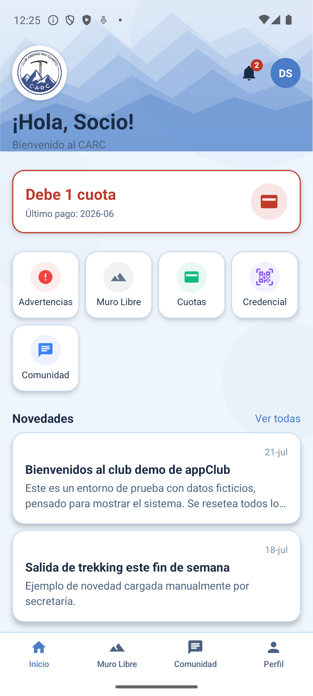
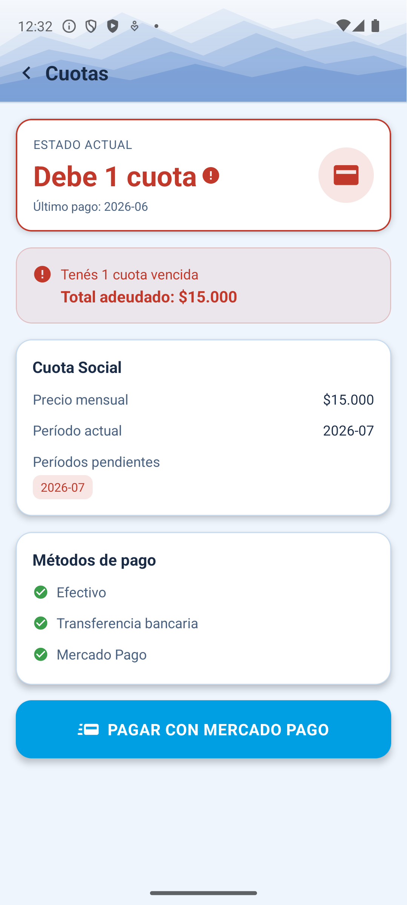
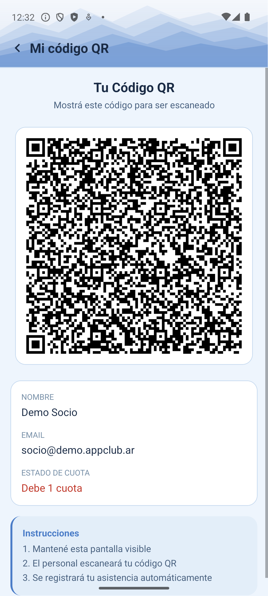
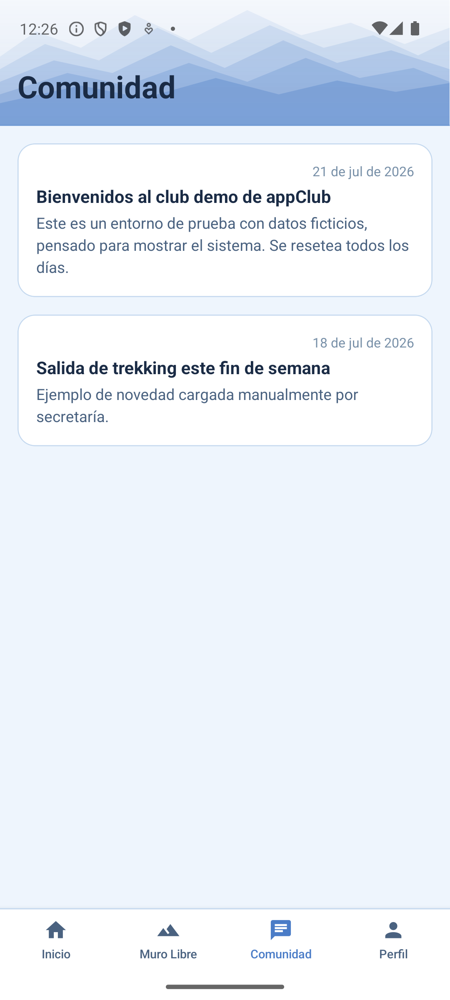
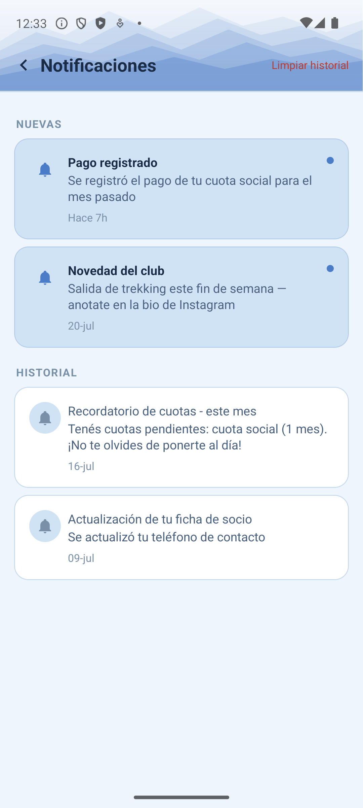

# Manual de Socio

Así ve la app un **socio** del club: su estado de cuenta, su credencial digital, las novedades del club y sus notificaciones. Todo pensado para resolverse en un par de toques, sin tener que llamar o ir en persona por una consulta simple.

```text title="Login de prueba"
socio@demo.appclub.ar / DemoSocio2026!
```

!!! tip "¿Ya sos socio del CARC?"
    Entrá con tu usuario real desde [/app/login](https://raspberrypi.tail703951.ts.net/app/login) para ver tu propia cuenta.

## 1. Inicio

De un vistazo: tu estado de cuota, accesos rápidos (Advertencias, Muro Libre, Cuotas, Credencial, Comunidad) y las últimas novedades del club.

<figure markdown>
  { width="260" }
  <figcaption>Inicio</figcaption>
</figure>

## 2. Ver y pagar tus cuotas

Muestra tu estado actual, el total adeudado si tenés cuotas vencidas, y los períodos pendientes. Si el club tiene Mercado Pago configurado, podés pagar directo desde ahí.

<figure markdown>
  { width="260" }
  <figcaption>Tus cuotas</figcaption>
</figure>

Si preferís pagar en efectivo o transferencia, se registra en persona por secretaría o admin (ver sus manuales, sección "Registrar el cobro de una cuota").

## 3. Credencial digital (QR)

Tu identificación como socio, sin necesidad de carnet físico. El personal del club escanea este código para verificar quién sos al hacer un check-in (por ejemplo, en escuelita o muro libre).

<figure markdown>
  { width="260" }
  <figcaption>Tu credencial</figcaption>
</figure>

## 4. Novedades del club

Anuncios, salidas y avisos del club, en la solapa `Comunidad`. Algunas se publican a mano y otras llegan automáticamente desde redes sociales o el RSS de una federación.

<figure markdown>
  { width="260" }
  <figcaption>Comunidad</figcaption>
</figure>

## 5. Notificaciones

Avisos personales: que se registró un pago tuyo, recordatorios de cuota, novedades nuevas del club, o cambios en tu ficha. Tocando el ícono de campana desde Inicio.

<figure markdown>
  { width="260" }
  <figcaption>Tus notificaciones</figcaption>
</figure>
