# Manual de Socio

Así ve la app un **socio** del club: su estado de cuenta, su credencial digital, las novedades del club y sus notificaciones. Todo pensado para resolverse en un par de toques, sin tener que llamar o ir en persona por una consulta simple.

```text title="Login de prueba"
socio@demo.appclub.ar / DemoSocio2026!
```

!!! tip "¿Ya sos socio del CARC?"
    Entrá con tu usuario real desde [/app/login](https://raspberrypi.tail703951.ts.net/app/login) para ver tu propia cuenta.

## 1. Inicio

De un vistazo: tu estado de cuota, accesos rápidos (Cuotas, Credencial, Comunidad y, si estás inscripto en escuelita, Mis clases) y las últimas novedades del club.

<figure markdown>
  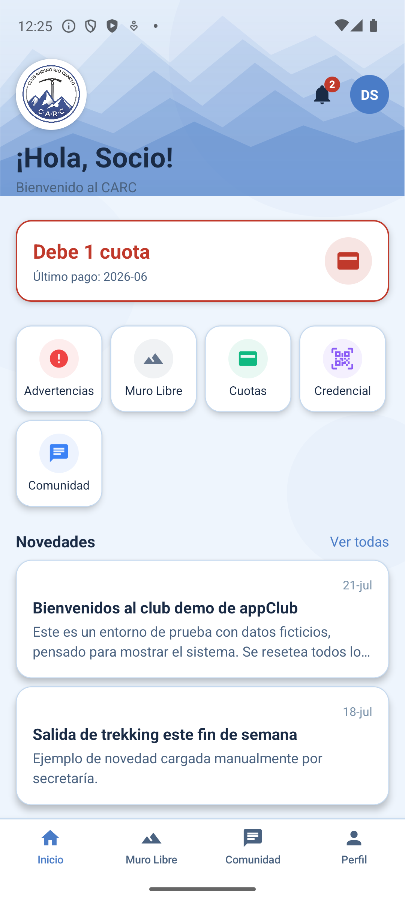{ width="260" }
  <figcaption>Inicio</figcaption>
</figure>

**Reordenar los accesos rápidos**

<figure markdown>
  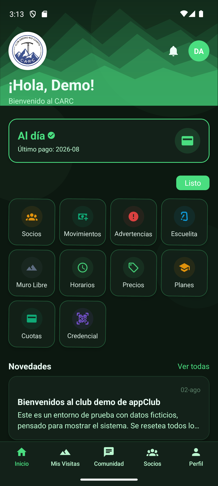{ width="260" }
  <figcaption>Mantené presionado un acceso para reordenar el grid</figcaption>
</figure>

Mantené presionado cualquier ícono del grid para entrar en modo edición, arrastrá para reordenarlos como prefieras, y tocá `Listo` para confirmar. El orden queda guardado en el celular (no es algo que vea el resto del equipo). Esto es igual para cualquier rol, no solo para socios.

## 2. Ver y pagar tus cuotas

Muestra tu estado actual y el total adeudado si tenés cuotas vencidas. Si tenés hijos vinculados, la deuda se muestra separada por perfil: la tuya y la de cada uno de ellos.

<figure markdown>
  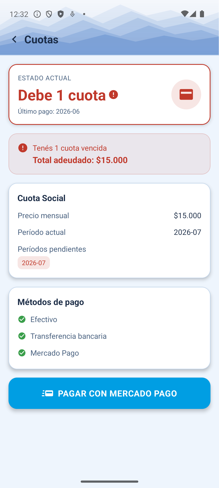{ width="260" }
  <figcaption>Tus cuotas</figcaption>
</figure>

Cada cuota o cargo pendiente tiene un interruptor para incluirlo o no en el pago (viene tildado por defecto). Si una cuota tiene varios períodos adeudados, podés elegir cuáles pagar tocando los chips de período uno por uno. El botón de Mercado Pago muestra el total de lo que tildaste ("PAGAR $X CON MERCADO PAGO") y queda deshabilitado ("ELEGÍ QUÉ PAGAR") si no dejaste nada tildado.

Si preferís pagar en efectivo o transferencia, se registra en persona por secretaría o admin (ver sus manuales, sección "Registrar el cobro de una cuota").

## 3. Credencial digital (QR)

Tu identificación como socio, sin necesidad de carnet físico. El personal del club puede escanearla para ubicar tu ficha al toque (por ejemplo, en la recepción) — ya no hace falta para que se registre tu asistencia en muro libre o escuelita, eso ahora se hace de otra forma (ver la sección siguiente).

<figure markdown>
  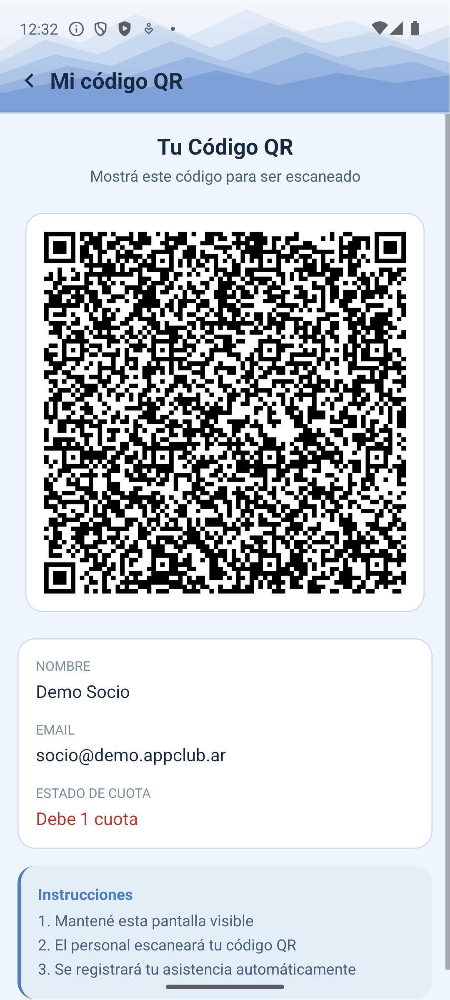{ width="260" }
  <figcaption>Tu credencial</figcaption>
</figure>

## 4. Check-in en Muro Libre y Escuelita

Para marcar tu asistencia ya no hace falta que te escaneen la credencial: en la pared del club hay un cartel fijo con un código QR (uno para Muro Libre, otro para Escuelita). Lo escaneás con la cámara normal de tu celular — ni siquiera hace falta abrir la app antes — y te lleva directo a una pantalla para confirmar el check-in.

- **Muro Libre:** el check-in queda registrado al toque. Si tenés un pase mensual vigente no se te genera ningún cargo; si no, queda pendiente de pago para abonarlo en el mostrador.

<figure markdown>
  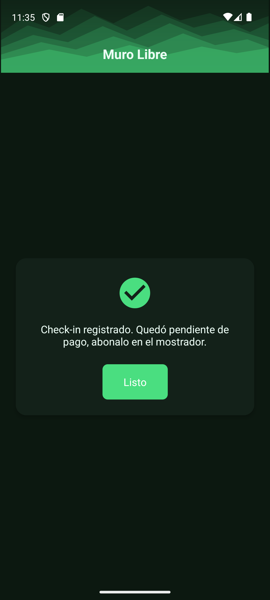{ width="260" }
  <figcaption>Check-in registrado</figcaption>
</figure>

- **Escuelita:** si entrás con tu propia cuenta, se registra directo tu asistencia. Si sos tutor de más de un hijo inscripto en escuelita, la app te pregunta "¿A quién marcamos?" antes de confirmar.

<figure markdown>
  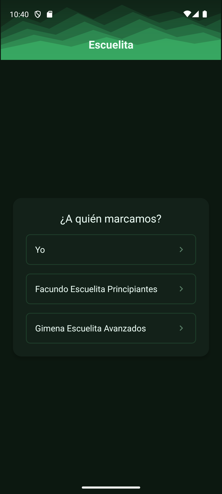{ width="260" }
  <figcaption>Si sos tutor de más de un hijo inscripto, elegís a quién marcar</figcaption>
</figure>

Si por algo el cartel no está disponible, el personal del club siempre puede cargar tu asistencia a mano buscándote por nombre o DNI.

## 5. Novedades del club

Anuncios, salidas y avisos del club, en la solapa `Comunidad`. Algunas se publican a mano y otras llegan automáticamente desde redes sociales o el RSS de una federación.

<figure markdown>
  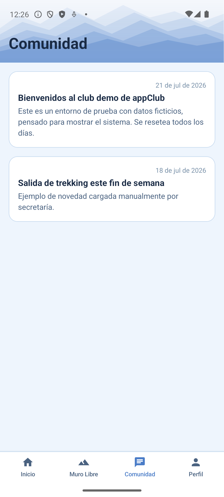{ width="260" }
  <figcaption>Comunidad</figcaption>
</figure>

## 6. Entrar como un hijo vinculado (para tutores)

Si sos tutor de uno o más socios (por ejemplo, tus hijos), no necesitás una cuenta separada para cada uno. Secretaría o admin te vincula desde la ficha de cada socio (ver el [manual de Admin](admin.md#2-vincular-a-un-tutor-padremadre-de-un-socio)), y desde ahí podés entrar como cualquiera de ellos con tu mismo usuario.

<figure markdown>
  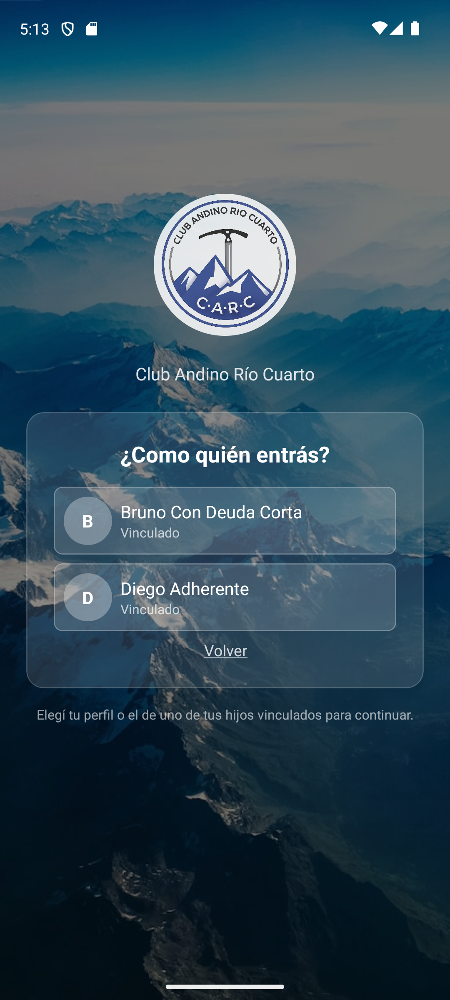{ width="260" }
  <figcaption>Si tenés más de un perfil, la app te pregunta al entrar</figcaption>
</figure>

Si tenés un solo perfil (el tuyo, sin ningún hijo vinculado), entrás directo — este paso solo aparece cuando hay más de uno para elegir.

**Cambiar de perfil sin volver a loguearte**

<figure markdown>
  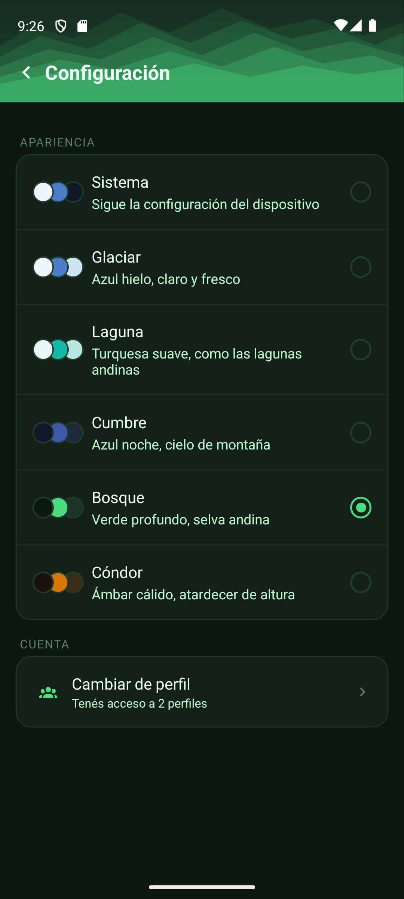{ width="260" }
  <figcaption>Cambiar de perfil desde Configuración</figcaption>
</figure>

1. Andá a `Perfil` → `Configuración` → `Cambiar de perfil`.
2. Elegí el perfil con el que querés entrar — el que está marcado es el activo en este momento.

<figure markdown>
  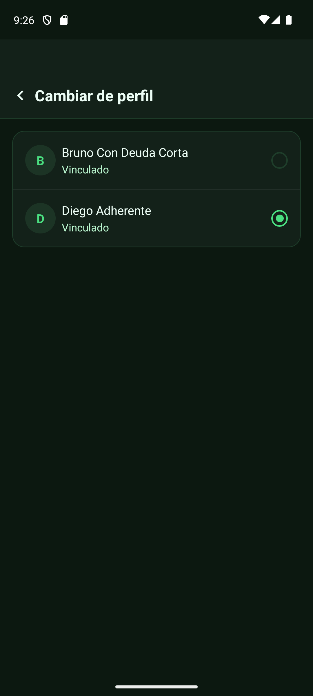{ width="260" }
  <figcaption>Lista de perfiles disponibles</figcaption>
</figure>

Todo lo que veas mientras actuás "como" un hijo vinculado (cuotas, credencial, notificaciones) es de ese socio, no tuyo — y solo con permisos de socio, aunque esa persona tenga otro rol en el club con su propia cuenta.

## 7. Mis clases (si estás inscripto en escuelita)

Si tenés una inscripción activa (o la tuviste alguna vez) en algún plan de escuelita, aparece una solapa `Mis clases` con tu propio historial de asistencias.

<figure markdown>
  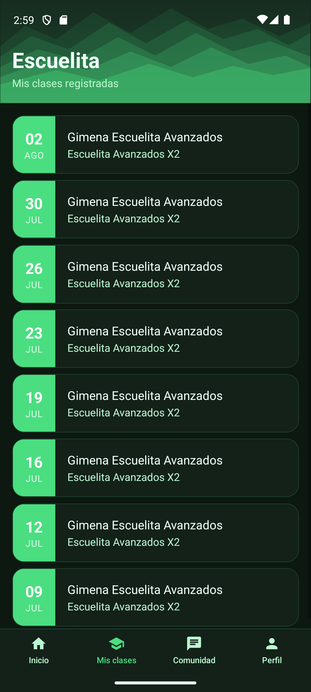{ width="260" }
  <figcaption>Tu historial de clases</figcaption>
</figure>

Esta solapa solo aparece si alguna vez tuviste una inscripción — si nunca fuiste alumno de escuelita, no la vas a ver.

## 8. Mis Visitas (si sos frecuente en muro libre)

Si registraste al menos una visita al muro de escalada, aparece la solapa `Mis Visitas` con tu propio historial de check-ins, el tipo de pase y cómo lo pagaste.

<figure markdown>
  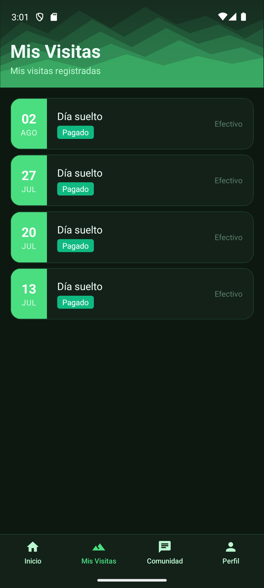{ width="260" }
  <figcaption>Tu historial de visitas a muro libre</figcaption>
</figure>

## 9. Notificaciones

Avisos personales: que se registró un pago tuyo, recordatorios de cuota, novedades nuevas del club, o cambios en tu ficha. Tocando el ícono de campana desde Inicio.

<figure markdown>
  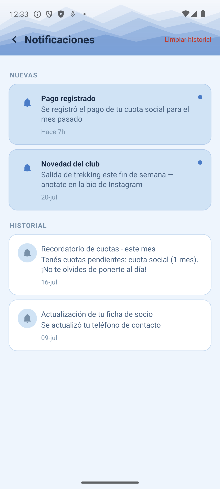{ width="260" }
  <figcaption>Tus notificaciones</figcaption>
</figure>
